# Hephaestus Architecture Reference

This document is the canonical, source-grounded architecture reference for
the Hephaestus automation pipeline and supporting subsystems. Every
operational claim links to the module that backs it.
The [`docs/adr/`](adr/) records remain the bind-points for individual
architectural decisions (`0006-queue-based-in-process-automation-pipeline`,
…) — this document is the unified reference; ADRs are the historical record.
This file is source-grounded: every operational claim links to the module
that backs it. Source citations use the forms
`module/file.py` and `§module/Class.func`, each paired with a relative link.
Per the project convention
(`"Code References": 'DO'` in [`AGENTS.md`](../AGENTS.md) §"Claude Code
Optimization"), file paths are repo-relative.

> **Maintenance:** Ownership follows
> [CODEOWNERS](../.github/CODEOWNERS). Changes to a cited pipeline module,
> route, stage, template, or workflow trigger review of the corresponding
> section. Local source targets and selected semantic source symbols are checked
> by `hephaestus.validation.doc_maintenance`.

---

## Table of contents

1. [Goals, non-goals and design principles](#1-goals-non-goals-and-design-principles)
2. [System overview: one coordinator, eight queues, two worker pools](#2-system-overview)
3. [Cross-cutting invariants](#3-cross-cutting-invariants)
4. [WorkItem and the durable journal](#4-workitem-and-the-durable-journal)
5. [The eight queue stages](#5-the-eight-queue-stages)

- [5.1 Repo intake](#51-repo-intake)
- [5.2 Planning](#52-planning)
- [5.3 Plan review](#53-plan-review)
- [5.4 Implementation](#54-implementation)
- [5.5 PR review](#55-pr-review)
- [5.6 Merge wait](#56-merge-wait)
- [5.7 Learning](#57-learning)
- [5.8 Finished](#58-finished)

1. [The ROUTES table — single source of truth](#6-the-routes-table)
2. [Seeding and restart reconstruction](#7-seeding-and-restart-reconstruction)
3. [The worker pool and job contract](#8-the-worker-pool-and-job-contract)
4. [Thin CLI scope wrappers and rollout controls](#9-thin-cli-scope-wrappers)
5. [Observability, dry-run and rate-budget gate](#10-observability-dry-run-and-rate-budget-gate)
6. [Automation ownership and architecture budgets](#11-automation-ownership-and-architecture-budgets)
7. [Interrupt semantics and exit codes](#12-interrupt-semantics-and-exit-codes)
8. [Glossary](#13-glossary)

---

## 1. Goals, non-goals and design principles

### Goals

- **Durable journals.** GitHub labels, comments, and PR state are the normal
 crash-resistant truth. `LearningJournalStore` records auxiliary intent
 claims and terminal results. The repository-scoped issue-wave checkpoint
 records only immutable selected issue identifiers, pending or retired
 reviewed non-code intents, terminal outcomes, merge receipts, and verified
 main revisions. Stages may not persist any other state. Restart =
re-run: queue reconstruction reads the journal
([`coordinator._seed_pass`](../hephaestus/automation/pipeline/coordinator.py),
[`seed_from_cli`](../hephaestus/automation/pipeline/seeding.py)) — distinct from
the per-repo seed-side [`repo._seed_pass`](../hephaestus/automation/pipeline/stages/repo.py)
in §5.1. Both paths classify tracker labels as semantic-review candidates;
neither writes `state:skip` during seeding.
- **Interrupt = resumable, never failed.** A SIGINT/SIGTERM/SIGHUP during a
 run parks the touched item with `ItemResult(passed=False,
 reason="resumable at <stage>", …)`. A subsequent restart seeds it back
 into the same queue and the loop reconverges
 ([`_park_resumable`](../hephaestus/automation/pipeline/coordinator.py),
 [`_finalize_resumable`](../hephaestus/automation/pipeline/coordinator.py)).
- **Reviewed-head proof, conditional queue merge.** `state:implementation-go`
 is applied only by `pr_review._eval`, which is the sole stage authorized to
 write the label. Before the reviewer runs, `pr_review` snapshots the GitHub
 review inputs and its head SHA, then requires a clean local checkout at that
 exact SHA. The resulting in-memory proof is rechecked against a confirmed,
 unarmed live PR before the label is written. `merge_wait` uses that same
 active-run proof before every request in a bounded sequence (default: five)
 of policy-selected server merge requests. Each request also requires
 complete passing required status evidence for that exact head. The evidence
 is an independent merge gate, not a substitute for the structural review proof.
 After the evidence passes, `merge_wait` reads the stable effective policy again.
 The new typed policy must equal the policy that supplied the required-check
 inventory. The stage applies bypass and conversation safety to the new policy.
 Before a request, it may make a bounded read-only readiness wait without
 spending a merge attempt. The `--poll-max-wait` option controls this wait. Its
 default is 1,200 seconds (20 minutes) for each fresh reviewed-head proof.
 Readiness is not authorization, and each request
 still has fresh open/`main`/unarmed/exclusive-GO admission.
 The adapter makes one request per call and never retries. A required merge
 queue uses exact-head GraphQL admission. Otherwise, direct REST merge requires
 strict-update protection from a source that the current actor cannot bypass.
 No queue stage invokes `gh pr merge`, creates, disables, adopts, or polls
 native auto-merge, or uses an administrator bypass
 ([`pr_review.py`](../hephaestus/automation/pipeline/stages/pr_review.py),
 [`worker_pool.py`](../hephaestus/automation/pipeline/worker_pool.py),
 [`merge_wait.py`](../hephaestus/automation/pipeline/stages/merge_wait.py)).
- **Globally bounded budgets.** Stages count retries on `_on_job_done` so
 `agent_error` retries consume the same per-item budget as ordinary
 attempts; cross-stage regression cycles terminate in finite steps
 ([`_FAIL_BACK_CAP`](../hephaestus/automation/pipeline/coordinator.py),
 [`ROUTES`](../hephaestus/automation/pipeline/routing.py)).
- **Globally bounded live work.** The coordinator admits at most
 `C = max(1, parallel_repos × max_workers)` nonterminal work items at once.
 A work permit remains with an item while it is queued, leased, running,
 timer-parked, or waiting for a full destination queue; it is released only
 after the finished sink records the terminal result
 ([`_work_window`](../hephaestus/automation/pipeline/coordinator.py),
 [`Coordinator._push_item`](../hephaestus/automation/pipeline/coordinator.py),
 [`Coordinator._release_work_permit`](../hephaestus/automation/pipeline/coordinator.py)).

### Non-goals

- **No persisted queue snapshot.** Queues are in-memory; reconstruction
 reads GitHub via [`seeding.py`](../hephaestus/automation/pipeline/seeding.py)
 ([`_all_idle`](../hephaestus/automation/pipeline/coordinator.py) +
 [`_reseed_if_converged`](../hephaestus/automation/pipeline/coordinator.py)).
- **No OS-level agent sandbox.** Each agent call site declares its explicit
 `--allowedTools` scope and runs in a scoped worktree
 ([`_run_agent`](../hephaestus/automation/pipeline/worker_pool.py),
 [`agent_config.py`](../hephaestus/automation/agent_config.py)).
- **No MCP runtime dependency.** `.mcp.json` is intentionally empty. Plugin
 marketplaces, NATS JetStream and HTTP REST remain the maintained
 integration contracts ([ADR-0011](adr/0011-mcp-integration-posture.md)).

### Design principles

- **KISS / YAGNI.** Each stage owns one responsibility. The deferred
 `AgentProtocol` and `resilience` wiring into the GitHub call path
 (issues #468, #469) are intentionally NOT built yet.
- **DRY / one-way dependency.** `automation → library` only — library
 subpackages may not import from
 [`hephaestus.automation`](../hephaestus/automation/), as defined by
 [`ADR-0001`](adr/0001-automation-library-boundary.md).
- **SOLID / substitutable providers.** [`hephaestus.agents.runtime`](../hephaestus/agents/runtime.py)
 abstracts over Claude Code, Codex, Pi (admission-gated), and OpenCode
 behind a uniform `--agent` flag.
- **POLA. Least privilege, least astonishment.** Per-call
 `--allowedTools`, scoped worktrees, fenced untrusted GitHub content
 via `_fence_untrusted` in
 [`prompts/_shared.py`](../hephaestus/automation/prompts/_shared.py) and
 admin-free CI/CD-gated merge.

---

## 2. System overview

### Topology

The default path is **`hephaestus-automation-loop`**, the queue-based
in-process pipeline whose coordinator lives at
[`hephaestus.automation.pipeline.coordinator`](../hephaestus/automation/pipeline/coordinator.py).
The coordinator owns **eight bounded in-memory stage queues**. It dispatches
ordinary agent, build-test, Git, and GitHub jobs to `WorkerPool`. It dispatches
host learning and terminal cleanup to `AuxiliaryWorkerPool`. Each agent
job runs Claude, Codex, admission-gated Pi, or OpenCode, chosen by `--agent`
(default Claude).

#### Main and auxiliary queue block diagram

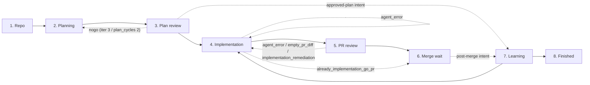

Every back-edge in the diagram is **named** in
[`ROUTES`](../hephaestus/automation/pipeline/routing.py) and is the "fail-route
reason vocabulary" stages must reference verbatim in `StageOutcome.note`.

### Coordinator / worker contract

The main thread (coordinator) OWNS:

- all eight stage queues ([`self.queues`](../hephaestus/automation/pipeline/coordinator.py))
- the timer heap ([`self.timers`](../hephaestus/automation/pipeline/coordinator.py))
- the in-flight registry ([`self.in_flight`](../hephaestus/automation/pipeline/coordinator.py))
- all routing and disposition semantics ([`_route`](../hephaestus/automation/pipeline/coordinator.py))
- coordinator-local GitHub reads and mutations, through
 [`StageGitHub`](../hephaestus/automation/pipeline/stages/base.py)
 (label writes, comment upserts, and PR creation; the queue does not mutate
 auto-merge)
It NEVER launches agents, builds/tests or git/network operations. It never
sleeps — wakeups are the timer's responsibility.
The main worker pool ([`WorkerPool`](../hephaestus/automation/pipeline/worker_pool.py))
executes everything else: agent invocations (Claude, Codex, Pi, or
OpenCode), build/test
subprocesses, git operations, and the closed worker-owned GitHub operations.
`StageContext.github` remains coordinator-thread-owned and never crosses this
boundary. Each [`GitHubJob`](../hephaestus/automation/pipeline/github_jobs.py)
contains one frozen request from a closed seven-operation algebra. The algebra
contains reply-journal recovery and append, reply delivery, PR-review
reconciliation, merge-wait admission, scope-expansion child creation, and
scope-expansion dependency reconciliation. The production
runner creates a fresh [`PipelineGitHub`](../hephaestus/automation/pipeline_github.py)
accessor per job. Same-repository GitHub jobs serialize under `_repo_lock`, while
different repositories may execute concurrently. No arbitrary callable, mutable
kwargs, `WorkItem`, stage callback, or shared service response crosses the worker
boundary. Every Claude agent invocation
routed through the worker pool binds to an explicit least-privilege
`--allowedTools` scope. An explicit [`AgentJob.allowed_tools`](../hephaestus/automation/pipeline/jobs.py)
grant wins (the `pr_review` job uses it for the reviewer skill); absent that,
read-only sandbox jobs use [`DEFAULT_TOOL_SCOPE`](../hephaestus/automation/pipeline/tool_scopes.py),
and all other jobs resolve through
[`tool_scope_for(agent)`](../hephaestus/automation/pipeline/tool_scopes.py) from
[`AGENT_TOOL_SCOPES`](../hephaestus/automation/pipeline/tool_scopes.py). An
unmapped role therefore falls through to the same read-only default rather
than the most permissive scope (#2319). Every git operation crosses
[`_repo_lock`](../hephaestus/automation/pipeline/worker_pool.py) (in-process
thread lock, outer) **and**
[`_interruptible_file_lock`](../hephaestus/automation/pipeline/worker_pool.py)
(cross-process flock, inner). Worktrees share `.git`, so two concurrent
operations on the same checkout would race.
The only cross-thread **payload** channels are the bounded main and auxiliary
[`CompletionQueue`](../hephaestus/automation/pipeline/queues.py) instances
(`queue.Queue[(JobHandle, JobResult)]`). A separate
`threading.Event` latch is control-plane-only: workers set it after a
non-blocking completion publish, and signal handlers set it to wake an idle
coordinator. Neither writes a sentinel into the completion queue or blocks on
queue capacity
([`WorkerPool._on_future_done`](../hephaestus/automation/pipeline/worker_pool.py),
[`Coordinator._wait_for_completion`](../hephaestus/automation/pipeline/coordinator.py),
[`Coordinator._wake_completion_wait`](../hephaestus/automation/pipeline/coordinator.py)).
The idle coordinator may wait on that event for its bounded poll interval
([`_IDLE_POLL_S = 1.0`](../hephaestus/automation/pipeline/coordinator.py)); it
does not make a producer or signal handler wait. Main pool size is
`parallel_repos × max_workers`. The auxiliary pool size is
`learning_workers`. Main queue capacity is
`C = max(1, parallel_repos × max_workers)`. Learning queue and permit capacity
use `learning_queue_capacity`. Auxiliary completion capacity is the larger of
`learning_queue_capacity` and `learning_workers`, so every running worker owns
a completion slot. Lane permits are independent.
([`_work_window`](../hephaestus/automation/pipeline/coordinator.py),
[`WorkerPool(size=…)`](../hephaestus/automation/pipeline/worker_pool.py)).

### Ticks

The per-tick event loop is defined in
[`Coordinator.run`](../hephaestus/automation/pipeline/coordinator.py). One
tick does, in order:

1. **Shutdown check** — graceful drain or immediate teardown after the
 grace window / a second signal
 ([`_grace_exceeded`](../hephaestus/automation/pipeline/coordinator.py),
 [`_immediate`](../hephaestus/automation/pipeline/coordinator.py)).
2. **Wake timers** — pop every expired entry back into its stage queue
 ([`_wake_timers`](../hephaestus/automation/pipeline/coordinator.py)).
3. **Drain completions** — handle ALL ready completions without blocking;
 interrupted results park the item RESUMABLE and never reach
 `on_job_done`
 ([`_drain_completions`](../hephaestus/automation/pipeline/coordinator.py),
 [`_park_resumable`](../hephaestus/automation/pipeline/coordinator.py)).
4. **Emit observability tick** — push queue-depth / in-flight / circuit
 breaker gauges and record alert transitions
 ([`_emit_observability_tick`](../hephaestus/automation/pipeline/coordinator.py)).
5. **Drain queues down-stream first** — `finished → learning → merge_wait →
 pr_review → implementation → plan_review → planning → repo`
 ([`_DRAIN_ORDER`](../hephaestus/automation/pipeline/coordinator.py)).
 Implementation drains separately to enforce dependency topo-order
 and file-overlap serialization; other queues drain with the per-repo
 in-flight cap. Pending destination-first handoffs are retried before and
 between drains, and bounded direct/repository sources are admitted only at
 safe capacity points ([`_drain_implementation`](../hephaestus/automation/pipeline/coordinator.py),
 [`_drain_queues`](../hephaestus/automation/pipeline/coordinator.py),
 [`_drain_pending_handoffs`](../hephaestus/automation/pipeline/coordinator.py),
 [`_drain_repo_issue_sources`](../hephaestus/automation/pipeline/coordinator.py),
 [`_admit`](../hephaestus/automation/pipeline/coordinator.py)).
6. **Idle-or-loop check** — if all queues + timers + in-flight are empty,
 re-seed up to `--loops` and either exit on zero work or continue
 ([`_all_idle`](../hephaestus/automation/pipeline/coordinator.py),
 [`_reseed_if_converged`](../hephaestus/automation/pipeline/coordinator.py)).
 Otherwise wait on the completion/signal latch and drain the bounded
 completion queue.
A defensive step watchdog ([`_STEP_WATCHDOG_S = 60.0`](../hephaestus/automation/pipeline/coordinator.py))
warns when any `stage.step()` call exceeds ~60 s. 15 s proved too tight in
practice: routine repo-stage steps (clone + label reads over the network)
breached it on nearly every multi-repo run, burying real stalls in noise
(#2648).

### Library → product layer boundary

[`hephaestus.automation`](../hephaestus/automation/) is the product layer. The
base import surface (`import hephaestus`) MUST NOT pull `curses`, `fcntl`,
`pydantic` or any `hephaestus.automation.*` module. Library subpackages
therefore cannot import `hephaestus.automation`.

---

## 3. Cross-cutting invariants

These invariants apply to **every** stage. Each stage section below cites
back to them.

### Journal-order invariant: durable write BEFORE the queue push

Every durable GitHub mutation (label add / remove / edit, comment upsert,
PR create) happens IMMEDIATELY BEFORE the
`StageOutcome` that causes the queue push. Restart then re-runs the stage
and the stage's idempotency checks (at-or-past label comparison, plan
comment presence, PR existence) fast-forward through already-completed
work. Interrupts therefore leave items RESUMABLE, never FAILED — a restart's
seeding classifies them back into the same entry queue and `on_enter`
restarts from the same state.
Implementation: coordinator-local writes use the single-owner
[`ctx.github`](../hephaestus/automation/pipeline/stages/base.py) accessor. Reply
journal recovery/append and delivery, PR-review reconciliation, and merge-wait
admission and the policy-selected merge request instead submit a closed
`GitHubJob`. Its receipt
embeds the exact immutable request and is accepted only when it equals the
item's pending request. The coordinator invokes `on_job_done()` while the item
is still in its submitting state, so the receipt is applied before installing
the next mini-state or routing to another queue. The coordinator's
[`_route`](../hephaestus/automation/pipeline/coordinator.py) applies the
disposition to the queue.

### Global capacity, leases, and source cursors

Let `C = max(1, parallel_repos × max_workers)`. `C` is a global live-work
window, not a per-stage concurrency target. Every stage queue and the
completion queue have capacity `C`, while the coordinator holds one global
permit for every nonterminal main-lane `WorkItem`. The auxiliary lane has its
own permit bound. Consequently, eight stage queues do not permit a multiple of
`C` simultaneous work items. An item keeps its lane permit while it moves
within that lane. A cross-lane handoff transfers permit ownership only after
the destination accepts the item. The auxiliary permit is released after
`finished` records the outcome.

The auxiliary lane carries only semantic learning intent. The Mnemosyne host
rebinds that intent to immutable GitHub facts, prepares one bounded validated
skill artifact, and converts it to the closed delivery request. Repository
binding, allowed paths, signed DCO commit, PR creation/reuse, and head readback
remain host-owned. Preparation or delivery failure is terminal only for the
ancillary learning record; it does not change the primary result, and cleanup
still waits for that terminal state.

The scheduler and the learning journal use the short repository name in the
durable intent key. At the host boundary, `LearningStage` qualifies this name
with the trusted organization and adds the short name as `identity_repo`. It
rejects malformed, foreign, or mismatched identities before host dispatch. An
identity rejection is terminal only for the ancillary learning record.

Queue draining claims an item through a
[`StageQueueLease`](../hephaestus/automation/pipeline/queues.py). The lease keeps
the source queue slot occupied while a stage runs. A transition is
destination-first: the destination must accept the item before the source
lease is released and the item stage/history/result are changed. When the
destination is full, the coordinator retains exactly one pending handoff on
that source lease and retries it after downstream drains. The completed stage
action is therefore not replayed, and a full destination is ordinary
backpressure rather than a spill list, shutdown, or failure
([`StageQueueLease.handoff`](../hephaestus/automation/pipeline/queues.py),
[`Coordinator._handoff_item`](../hephaestus/automation/pipeline/coordinator.py),
[`Coordinator._drain_pending_handoffs`](../hephaestus/automation/pipeline/coordinator.py)).
Leases carry stable FIFO tickets, so multiple ready items can be claimed and
run concurrently up to `C`; a retry restores ahead of later-admitted work
without serializing the whole stage.

Intake is also source-driven rather than an eager list of classified products:

- Explicit `--issues` and `--prs` use one cursor each. The coordinator
  classifies the next value only after every possible entry queue and the
  global live-work window can accept it; unadmitted caller input remains in
  the iterator, not in a `SeedEntry` or `WorkItem` spill buffer.
- Repository intake uses a FIFO repository source. Once a repo has prepared
  its checkout, its `RepoIssueSource` retains at most one pending metadata row
  and one fetched GitHub page. The coordinator keeps at most `C` active repo
  sources and gives each one admission attempt per FIFO round-robin, so a large
  repository cannot monopolize discovery.
- Organization repositories and linked-issue metadata use REST pages of at
  most 100 rows. Pagination continues until the short terminal page; there is
  no `gh ... --limit 500` discovery cap. An organization invocation passes a
  resettable paged repository iterator directly to the FIFO source; it never
  materializes the organization's names in CLI scope resolution or pipeline
  configuration. Each active repository cursor consumes issue metadata lazily.
  Repository
  discovery does not pre-scan open-PR pages: PR review context enters through
  the linked issue's classification. An orphan PR has no issue requirements
  and remains outside this source; an explicit `--prs` scope can select one
  for fail-closed direct evaluation, but cannot supply missing requirements.
- A checkpointed `--issue-limit` run admits wave selection after synchronized
  checkout and before label setup. It seals the first eligible 1, 2, 4, 8, or
  all issue identifiers and drains that source once; `--loops` cannot reseed it.
  Later waves require fresh facts, loop-owned merge receipts, and read-only Git
  ancestry against the synchronized main revision. A completed rollout is
  audit-only; explicit `--issues`/`--prs` remain identifier-based recovery.

The implementation is in
[`Coordinator._drain_direct_issue_source`](../hephaestus/automation/pipeline/coordinator.py),
[`Coordinator._drain_repo_entry_source`](../hephaestus/automation/pipeline/coordinator.py),
[`Coordinator._drain_repo_issue_sources`](../hephaestus/automation/pipeline/coordinator.py),
[`RepoIssueSource`](../hephaestus/automation/pipeline/stages/repo.py), and
[`loop_repo_manager`](../hephaestus/automation/loop_repo_manager.py).

### Non-blocking retry / timer-park contract

Stages never sleep — the coordinator's timer heap owns every delay.
When a stage wants to wait (typically on a CI poll), it writes the delay
into `item.payload["retry_delay_s"]` and returns
`StageOutcome(Disposition.RETRY, note)`. The coordinator's
[`_route_retry`](../hephaestus/automation/pipeline/coordinator.py) reads that
key and parks the item on the heap
([`_timer_park`](../hephaestus/automation/pipeline/coordinator.py)).
A missing key means "retry on the next drain tick" (no delay).
[`BACKOFF_CAP_S = 60`](../hephaestus/automation/pipeline/stages/base.py) is
shared by every stage that uses the legacy exponential poll delay.
Timer parking releases the source-stage lease but retains the item's global
work permit. On expiry, the timer heap remains the item's owner until its
stage queue accepts it; an occupied stage queue leaves the expired entry at
the heap head for a later tick. That is bounded backpressure, not an overflow
or a reason to repeat the delayed stage action
([`_timer_park`](../hephaestus/automation/pipeline/coordinator.py),
[`_wake_timers`](../hephaestus/automation/pipeline/coordinator.py)).

### Interrupt semantics

`Coordinator.run` installs SIGINT, SIGTERM, SIGHUP handlers
([`_install_signal_handlers`](../hephaestus/automation/pipeline/coordinator.py)).
A first signal sets `shutdown` and starts a graceful drain window
([`_DEFAULT_GRACE_S = 30.0`](../hephaestus/automation/pipeline/coordinator.py)).
The coordinator stops admitting new work, drains in-flight to RESUMABLE and parks touched items at their current stage. A second signal or an
expired grace window, tears the pool down immediately and the coordinator
synthesizes interrupted results for remaining in-flight jobs.
Items touched by an interrupt report
`ItemResult(passed=False, reason="resumable at <stage>", …)` — **never** FAILED. The
end-of-run summary lists them under `RESUMABLE at <stage>`. Resume is
label/PR/worktree reconstruction: rerunning the same scoped command
re-seeds each item into the correct entry queue. There is no persisted
queue snapshot.
The signal handler only sets the shutdown and wake latches; it never writes
to, or waits on, the bounded completion queue. Completion-queue saturation is
an internal invariant violation: the worker callback records a latch without
blocking or spilling, the coordinator fails the run, and still-live work is
finalized resumably. It does not set `shutdown` and does not turn into exit
code 130 ([`WorkerPool._on_future_done`](../hephaestus/automation/pipeline/worker_pool.py),
[`Coordinator._drain_completions`](../hephaestus/automation/pipeline/coordinator.py)).

### Exit codes

- `130` — interrupted by SIGINT, SIGTERM, or SIGHUP.
- `1` — any effective item failed, skipped, blocked; or the coordinator hit a fatal error.
- `0` — clean run.
[`_exit_code`](../hephaestus/automation/pipeline/coordinator.py) deliberately
gives `130` priority over non-passing ledger entries and fatal coordinator
errors: a signal means the run did not complete.

### Effective-item rule

The summary uses `latest_logical_items(self.items)` from
[`summary.py`](../hephaestus/automation/pipeline/summary.py) so a re-seeded
item's superseded attempts are collapsed before per-row / exit-code /
preserved-worktree calculation. The current item's own failed, skipped or blocked result still counts; an old failed attempt that was superseded
by a later passing attempt does not. Pull requests already merged/closed are
terminalized before summary collapse so stale attempts cannot re-enter the queue.

### Rate-budget gate

The legacy `_maybe_sleep_for_rate_budget` SLEEPS its loop thread — fatal
for a single coordinator thread. The new gate lives at the submit
chokepoint ([`_submit`](../hephaestus/automation/pipeline/coordinator.py)):
[`_rate_budget_ok`](../hephaestus/automation/pipeline/coordinator.py) calls
[`hephaestus.automation.pipeline_github.rate_budget_ok`](../hephaestus/automation/pipeline_github.py)
and timer-parks an `AgentJob` until the upstream reset when the GraphQL
budget is low. Git/build jobs are unaffected. No `time.sleep` lives in any
stage module.

### Dry-run

When `--dry-run` is set, the coordinator:

- logs would-submit job descriptions and ADVANCEs the item
 ([`_run_item`](../hephaestus/automation/pipeline/coordinator.py));
- asserts no job is EVER submitted
 ([`_submit`](../hephaestus/automation/pipeline/coordinator.py));
- log-and-skip mutators in
 [`StageGitHub`](../hephaestus/automation/pipeline/stages/base.py);
- finishes items instead of parking on RETRY with `retry_delay_s` (the
 preview will never see real-world CI / merge progress)
 ([`_route_retry`](../hephaestus/automation/pipeline/coordinator.py));
- finishes items instead of failing back on FAIL_BACK (a dry-run mutator
 never writes the labels an earlier stage would re-check, so a regression
 would ping-pong until the safety cap)
 ([`_route_fail_back`](../hephaestus/automation/pipeline/coordinator.py)).
The fleet-sync `--dry-run` is also a preview contract (see
[`AGENTS.md`](../AGENTS.md) §"Claude non-interactive permission policy").

### Poisoned-item fail-safety

Every `_run_item` call is wrapped in a per-item `try/except`; an item that
raises an unhandled exception inside a stage accessor is logged and routed
to [`FINISH_FAIL`](../hephaestus/automation/pipeline/routing.py) instead of
terminating the loop, so one bad item never poisons the whole run (#2295).
Equivalently, when a `scope.trimmed_routes()` rewrite or a stage's own
`ROUTES` row has no `next`/`fail` mapping, the item lands at the next valid
mapping or `finished(fail)` rather than raising `KeyError`.

### Closed-schema stage events

Stage-originated JSONL events use the closed schema in
[`events.py`](../hephaestus/automation/pipeline/events.py). The event surface is
intentionally minimal: `encode_stage_event` currently rejects every event, so
no stage event can carry reviewer text, GitHub bodies, or authorization facts.

### Scope trimming

[`PipelineScope`](../hephaestus/automation/pipeline/routing.py) lets the
coordinator route items through a contiguous subset of stages
(`hephaestus-plan-issues` runs `planning → plan_review`;
`hephaestus-implement-issues` runs `implementation → pr_review`).
`hephaestus-merge-prs` is the manual merge-driving command outside the queue
coordinator (see [`hephaestus.github.pr_merge`](../hephaestus/github/pr_merge.py)). `trimmed_routes()` rewrites every out-of-scope next/fail
target to `FINISHED`, so the partial route table is closed under
`scope ∪ {FINISHED}`. The coordinator always re-adds the universal sink:
see [`_routes = config.scope.trimmed_routes()`](../hephaestus/automation/pipeline/coordinator.py).
`--force` on the planner CLI re-routes any at-or-past-scope stage back to
the scope's first stage so the scoped work is redone
([`_scope_seed_decision`](../hephaestus/automation/pipeline/coordinator.py)).

### Cross-stage ping-pong bound

Some regression edges (`pr_review → implementation` for `agent_error`,
`empty_pr_diff`, or `implementation_remediation`)
can ping-pong. The
[`_FAIL_BACK_CAP`](../hephaestus/automation/pipeline/coordinator.py)
constant is the sum of every budget in
[`ROUTES`](../hephaestus/automation/pipeline/routing.py). Stages enforce the
real per-key budgets themselves; the safety cap only guarantees
cross-stage cycles terminate even if a stage has a budget bookkeeping bug
([`_route_fail_back`](../hephaestus/automation/pipeline/coordinator.py)).

---

## 4. WorkItem and the durable journal

### [§`WorkItem`](../hephaestus/automation/pipeline/work_item.py)

The single per-item record moving through the queue. Thread-safety is by
construction: a `WorkItem` and its `StageQueue` are only ever touched by
the coordinator thread; the only cross-thread payload channels are the bounded
main and auxiliary completion queues. Event latches
carry wake/fault signals only, never `WorkItem` or `JobResult` payloads.
Key fields:

- `repo`, `kind` ([`ItemKind`](../hephaestus/automation/pipeline/work_item.py)) —
 repo / issue / PR.
- `issue` (optional), `pr` (optional) — the GitHub identifier.
- `stage` ([`StageName`](../hephaestus/automation/pipeline/routing.py)) —
 current queue.
- `state` — stage-local mini-state string (never a label).
- `attempts` — `dict` keyed by ROUTES budget names. Per-item-lifetime
 counter; never reset when an item re-enters a stage
 ([`_default_attempts`](../hephaestus/automation/pipeline/work_item.py),
 [`routing.py`](../hephaestus/automation/pipeline/routing.py) module
 docstring).
- `history` — `deque[HistoryEvent]` capped at
 [`HISTORY_CAP = 200`](../hephaestus/automation/pipeline/work_item.py).
- `session_ids` — `dict[str, str]`, populated by agent invocations.
- `labels_cache` — last-known diagnostic label set. Planning and plan-review
 transition gates require a fresh GitHub read; cached labels never authorize
 advancement.
- `payload` — `dict[str, Any]`. The stage-local scratchpad for cross-step
 handoff (`retry_delay_s`, base-captured `base_branch`, validated audit facts,
 and host-read implementation-reply receipts). It is not a durable
 authorization channel.
- `result` ([`ItemResult`](../hephaestus/automation/pipeline/work_item.py)) —
 final `passed / reason / final_stage` written by
 [`_finish`](../hephaestus/automation/pipeline/coordinator.py).
- `worktree`, `branch` — populated by [`implementation`](../hephaestus/automation/pipeline/stages/implementation.py).

### [§`StageName`](../hephaestus/automation/pipeline/routing.py)

`str`-flavored `Enum`:

```
REPO → PLANNING → PLAN_REVIEW → IMPLEMENTATION → PR_REVIEW → MERGE_WAIT
LEARNING → FINISHED
```

[`ROUTES`](../hephaestus/automation/pipeline/routing.py) insertion order
defines `PIPELINE_ORDER`; the coordinator initializes queues in that order and
derives `_DRAIN_ORDER` by reversing it. Lane membership remains explicit:
`MAIN_PIPELINE_ORDER` filters main-lane stages from that derived order, while
`AUXILIARY_PIPELINE_ORDER` filters `LEARNING` and `FINISHED`. `PipelineScope`
uses the derived main-lane order for contiguity and scoped-entry decisions.
`FINISHED` must remain the final `ROUTES` row so downstream-first draining
records terminal work before learning and main-lane work.

### [§`Disposition`](../hephaestus/automation/pipeline/routing.py)

`str`-flavored `Enum` returned in
[`StageOutcome.disposition`](../hephaestus/automation/pipeline/routing.py):

- `ADVANCE` — route to `ROUTES[stage].next`.
- `RETRY` — read `payload["retry_delay_s"]`, timer-park (or re-push if
 missing) to `stage`.
- `FAIL_BACK` — reason-keyed regression via
 `ROUTES[stage].fail_routes.get(note, …)`; failing-back from the
 coordinator's safety cap finishes failed.
- `SKIP` — finish failed with reason `skip:<note>`.
- `EJECT` — remove work that a different live process owns. Record a passed
 terminal summary without cleanup or another delivery attempt.
- `BLOCKED` — finish failed with reason `blocked:<note>`.
- `FINISH_PASS` / `FINISH_FAIL` — terminal; pass with reason `<note>` /
 fail with reason `<note>`.
The disposition funnel is exhaustive: every layer in
[`Disposition`](../hephaestus/automation/pipeline/routing.py) has a branch
in [`_route`](../hephaestus/automation/pipeline/coordinator.py), so a new
value would be a static `TypeError` and a safe routing table edit.

### State-label vocabulary

Defined in [`state_labels.py`](../hephaestus/automation/state_labels.py) and
imported throughout the pipeline. Seven labels: four mutually exclusive
planning states, two mutually exclusive implementation-review states, and one
absolute operator state:

| Label | Group | Authoritative stage |
|--------------------------------|--------------|---------------------------------|
| `state:needs-plan` | planner-scope| [`planning.on_enter`](../hephaestus/automation/pipeline/stages/planning.py) |
| `state:plan-no-go` | planner-scope| [`plan_review._eval`](../hephaestus/automation/pipeline/stages/plan_review.py) |
| `state:plan-go` | planner-scope| [`plan_review._eval`](../hephaestus/automation/pipeline/stages/plan_review.py) |
| `state:plan-blocked` | planner-scope| [`plan_review._eval`](../hephaestus/automation/pipeline/stages/plan_review.py) |
| `state:implementation-no-go` | review-scope | [`pr_review._eval`](../hephaestus/automation/pipeline/stages/pr_review.py) |
| `state:implementation-go` | review-scope | [`pr_review._eval`](../hephaestus/automation/pipeline/stages/pr_review.py) — automated implementation eligibility |
| `state:skip` | absolute | operator / confirmed semantic disposition in [`planning`](../hephaestus/automation/pipeline/stages/planning.py) / exhaustion in [`pr_review`](../hephaestus/automation/pipeline/stages/pr_review.py) |

Every **stage-issued** `state:skip` write uses the label as its durable
authority and emits the reason to structured run logs. It does not add an
issue comment, except that a confirmed obsolete disposition retains one
bounded actor-owned explanation comment as audit context. Both seeding paths
are read-only for tracker and epic candidates. Only
[`planning`](../hephaestus/automation/pipeline/stages/planning.py) may add the
skip and supplemental semantic labels after two independent model decisions
and exact label readback.

Label colors per [`STATE_LABEL_SPECS`](../hephaestus/automation/state_labels.py).
Provisioning script
([`hephaestus-ensure-state-labels`](../scripts/)) creates them on a repo.

#### Ordered rank (`_LABEL_RANK`)

Used by [`seeding.py`](../hephaestus/automation/pipeline/seeding.py) and
[`planning.on_enter`](../hephaestus/automation/pipeline/stages/planning.py).
**NEVER use equality.** The at-or-past comparison is the only read the
gate trusts:

```
needs-plan : 0
plan-no-go : 1
plan-go : 2
implementation-no-go: 3
implementation-go : 4
state:skip : NO RANK (excluded from rank compare)
```

A label alone never authorizes merge. The three independent admission facts
are:

```text
state:implementation-go ────────► automated eligibility
current-process head proof ─────► reviewed checkout identity
exact-head status evidence ─────► current CI merge gate
                                 │
                                 ▼
                      SHA-conditional squash merge
```

`merge_wait` requires the implementation-GO label, a matching in-memory
reviewed-head proof on an open `main`, confirmed-unarmed live PR with an
exclusive GO label, no unresolved review threads, and complete passing required
status evidence for that head. A missing or drifted proof,
failed or missing required status evidence, or untrusted merge state blocks
without a label mutation. A matching set
permits a bounded sequence (default: five) of policy-selected server requests.
A required merge queue uses exact-head GraphQL admission. Otherwise, a direct
SHA-conditional REST squash merge requires strict-update protection from a
source that the current actor cannot bypass. A read-only readiness wait may park for
the `--poll-max-wait` period. Its default is 1,200 seconds (20 minutes) for each
fresh proof. Readiness and review prose never authorize
merging, and fresh admission precedes every request
([`merge_wait.py`](../hephaestus/automation/pipeline/stages/merge_wait.py)).

Plan-review labels remain durable routing state. Native review records remain
part of review-thread and scope data, but a second user and a marked native
`APPROVED` review are not merge prerequisites. Comment markers locate
actor-owned journal artifacts only; foreign marker text is ignored.

Implementation reviewers emit a structural audit, not a textual decision.
The host derives any implementation-state transition from that audit and
current GitHub facts, then confirms the relevant GitHub `state:*` label. Text
such as `Verdict: GO` or `Verdict: NOGO` is rejected as an implementation
review decision and cannot authorize, block, or backfill a transition. Plan
review instead ends with its explicit `state:plan-*` journal token. On restart,
seeding reads labels and PR state, never reviewer decision prose.

---

## 5. The eight queue stages

The eight stages are architectural responsibilities, not implementation
modules. This section describes boundaries, durable state, and transitions.
Worker types, helper functions, payload fields, and source-code structure are
intentionally omitted.

### Queue block diagram

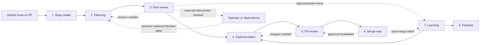

GitHub facts reconstruct the main workflow after a restart. The learning
journal, arming store, and issue-wave checkpoints reconstruct their owned
auxiliary, merge, and issue-wave obligations.

### 5.1 Repo intake

Repo intake discovers candidate work through a bounded source, records
exclusions, and routes each eligible issue or pull request to the stage implied
by its durable state.

Before it reads a direct `--issues` / `--prs` scope, performs a label mutation,
or dispatches an agent, repo intake proves a clean isolated control plane at
the fetched remote default-branch head. The caller checkout supplies only
repository identity and the Git common directory. It can be dirty, detached,
or on a non-default branch; its files, index, branch, and status are not
changed. A missing repository is cloned and then subjected to the existing
strict synchronization proof. Any failure is terminal for that scope; it
never falls through to an ambient or stale checkout.

Repo intake has three separate worktree layers:

- The user checkout is the caller-selected repository identity input.
- The per-repository intake worktree is an automation-owned detached checkout
  outside the user checkout. Its receipt records the common directory, exact
  fetched SHA, default branch, and ownership generation.
- The per-item implementation and review worktrees are created from the
  verified intake worktree. They retain their existing strict dirty-state and
  cleanup checks.

The intake worktree is created or rebound only under the shared Git metadata
lock. A valid clean receipt is reused. A dirty, symlinked, unregistered,
foreign, or mismatched path is preserved and fails closed. Intake never
attaches the default branch a second time.

#### Boundary diagram

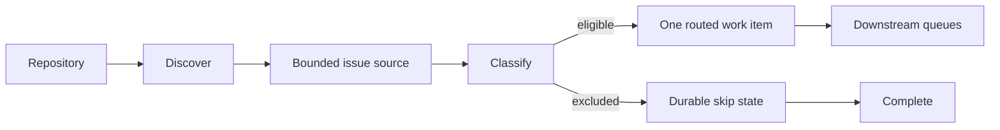

#### State machine

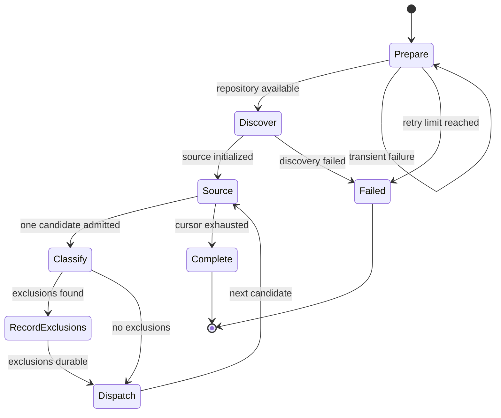

Architectural contract:

- Exclusions become durable before excluded work leaves the queue.
- Label-vocabulary setup and source classification occur only after the
  isolated intake receipt and exact SHA proof succeed. Explicit scopes use the
  same bounded direct cursors after that gate; they do not bypass it or widen
  their selected stage scope.
- Discovery never writes planning, review, implementation, or merge verdicts.
- Failure of the repository item does not fabricate outcomes for its issues.
- Runtime repository discovery does not eagerly build `products` or downstream
  `WorkItem` lists. It fetches one issue page at a time, holds at most one
  pending metadata row per active repository cursor, and drains active cursors
  in FIFO round-robin order.

### 5.2 Planning

Planning first establishes that the issue body contains requirements rather
than a copied canonical plan, review, or history artifact. Exact derived
markers at the start of the body trigger an evidence-bound reconstruction by
the planner model and an independent reviewer-model decision. A successful
recovery writes an actor-owned provenance comment and immediately begins a
fresh plan/review epoch; it never replaces the issue body.
Planning then produces one canonical implementation plan from the issue,
latest canonical plan, and latest canonical review. Superseded revisions are
replaced, not appended. Bounded hidden fingerprints preserve oscillation
detection without exposing old plans or raw patches. A blocked plan is an
automation stop: only an external actor may resolve the dependency and replace
`state:plan-blocked` with exactly one next plan-state label.

#### Boundary diagram

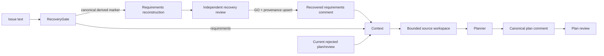

#### State machine

```mermaid
stateDiagram-v2
    [*] --> Eligibility
    Eligibility --> RecoverRequirements: derived body or semantic skip candidate
    RecoverRequirements --> ReviewRecovery: typed proposal
    ReviewRecovery --> RecoverRequirements: NOGO; retry remains
    ReviewRecovery --> Failed: NOGO exhausted; state:plan-no-go retained
    ReviewRecovery --> Failed: unavailable evidence; state:plan-no-go retained
    ReviewRecovery --> Skipped: independently confirmed tracker or obsolete issue
    ReviewRecovery --> BuildContext: requirements GO; digest/readback confirmed
    Eligibility --> Skipped: state:skip
    Eligibility --> Ready: approved plan exists
    Eligibility --> AwaitOperator: state:plan-blocked present
    Eligibility --> BuildContext: eligible plan-state label
    AwaitOperator --> Eligibility: external actor replaces blocked label
    BuildContext --> SourceWorkspace
    SourceWorkspace --> Draft: exact revision and locks confirmed
    SourceWorkspace --> SourceWorkspace: bounded lock or Git retry
    SourceWorkspace --> Failed: preparation budget exhausted
    Draft --> Verify: candidate produced
    Draft --> Draft: recoverable failure
    Verify --> Publish: candidate complete
    Verify --> Draft: candidate unusable
    Verify --> Failed: retry limit reached
    Publish --> Ready: canonical plan updated; label transition confirmed
    Ready --> [*]
    Skipped --> [*]
    Failed --> [*]
```

Architectural contract:

- The first automation journal role is the canonical implementation plan,
  identified only when its opaque marker is the exact first raw line and
  updated only by its owning GitHub actor. The human-readable `# Implementation
  Plan` heading remains display text on the next line; heading-only,
  whitespace-prefixed, and same-line-suffix lookalikes are inert audit text.
- If no canonical plan pointer exists, an upsert creates a new canonical
  comment beside any historical heading-only comment. It never patches,
  deletes, or migrates that historical display record.
- A restarted rejected plan receives only its bounded current canonical plan
  and paired current review. Superseded revisions are not public comments; the
  latest plan carries bounded prior fingerprints for no-progress detection.
- Journal ingestion is bounded by both comment count and body bytes. If either
  limit is exceeded, automation stops with an explicit manual-recovery error
  instead of silently dropping old plan/review revisions.
- Raw patches (`diff --git`, unified hunks, or fenced `diff` blocks) are
  rejected before publication.
- Requirements recovery is a planning substate, not a separate queue. The
  hidden provenance marker records the source-body, reconstructed-requirements,
  and evidence-binding SHA-256 digests in one actor-owned comment. Publication
  is read back by the role upsert; restart accepts it only when GitHub proves
  its ownership and its source digest matches the current issue body. GitHub
  exposes no atomic issue-body compare-and-swap, so automation never replaces
  the body and cannot overwrite a concurrent human edit.
- Tracker and obsolete dispositions require matching planner and independent
  reviewer decisions. Both apply `state:skip`; tracker confirmation also adds
  `epic`. An obsolete outcome retains exactly one actor-owned explanation
  comment beside the label; it is audit context only, and labels remain the
  restart-routing authority. The issue remains open.
- Ordinary recovery-review or plan-review exhaustion leaves
  `state:plan-no-go`; `state:plan-blocked` remains exceptional rather than a
  third ordinary review outcome.
- Each durable state transition is published with its corresponding canonical
  artifact, and restart routing reads the label rather than comment prose.
- Source-workspace preparation runs before each source-reading planning job. It
  uses a 45-second deadline, takes the source-lane lock before the Git metadata
  lock, and uses non-blocking lock acquisition in this bounded path. Lock
  contention and Git timeout return a timer-backed retry; preparation failure
  does not start an agent job.
- Source preparation has a separate retry budget from plan generation. A
  failed bounded attempt leaves the item at its current planning state. It
  writes no source-workspace receipt, and a later attempt can verify and reuse
  a clean partial checkout without weakening ownership or revision checks.
- `state:plan-blocked` is never removed or replaced by ordinary planning. An
  authenticated Athena-finalized body is the narrow exception because it
  proves the planning decision already completed. Comments otherwise do
  not revive it. After resolving the dependency, an external actor sets exactly
  one next state: ordinarily `state:plan-no-go` to request amendment,
  `state:plan-go` to approve, or `state:needs-plan` only when no canonical plan
  should be reused.

### 5.3 Plan review

Plan review decides whether the canonical plan is ready, can improve through a
bounded revision, or needs external intervention. The GitHub issue label is the
sole durable authority: `state:plan-go`, `state:plan-no-go`, or
`state:plan-blocked`. Reviewer output proposes one of those labels, but routing
occurs only after GitHub confirms the label write. The canonical review remains
an audit record and context source, never an authorization fallback.

#### Boundary diagram

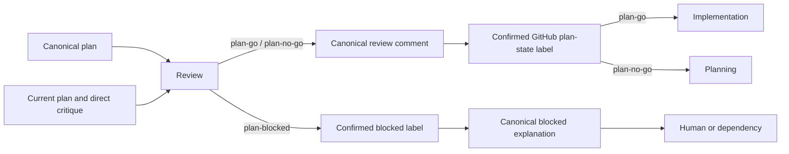

#### State machine

```mermaid
stateDiagram-v2
    [*] --> ReconcileJournal
    ReconcileJournal --> LoadHistory: canonical comments complete
    ReconcileJournal --> ReconcileJournal: legacy archive recovered
    ReconcileJournal --> Failed: conflicting actor-owned immutable artifact
    LoadHistory --> Review: context available
    LoadHistory --> Failed: context unavailable
    Review --> RetryReview: invalid reviewer response
    RetryReview --> Review: retry available
    RetryReview --> Failed: reviewer failures exhausted
    Review --> PublishAudit: plan-go or plan-no-go proposal
    Review --> ApplyBlocked: plan-blocked proposal
    ApplyBlocked --> RetryReview: blocked label write or confirmation failed
    ApplyBlocked --> PublishBlockedAudit: state:plan-blocked confirmed
    PublishBlockedAudit --> Blocked: explanation stored; latch remains on audit failure
    PublishAudit --> ApplyLabel: review comment stored
    ApplyLabel --> RetryReview: label write or confirmation failed
    ApplyLabel --> Approved: state:plan-go confirmed
    ApplyLabel --> AssessRevision: state:plan-no-go confirmed
    AssessRevision --> Amend: improvement remains possible
    AssessRevision --> Blocked: no improvement and planning is stuck
    AssessRevision --> Blocked: external decision or dependency required
    AssessRevision --> Failed: revision limit reached
    Amend --> PublishRevision: revised plan produced
    PublishRevision --> Review: canonical comments updated
    Approved --> [*]
    Blocked --> [*]
    Failed --> [*]
```

Architectural contract:

- The second automation journal role is the canonical plan review, identified
  only when its opaque marker is the exact first raw line and updated only by
  its owning GitHub actor. The human-readable `## 🔍 Plan Review` heading is
  display text only; heading-only history cannot be reconstructed or mutated.
- Marker collisions authored by other actors are inert. They cannot become
  canonical artifacts, establish replay identity, or stop an owned write.
- Canonical comments are replaced in place. On restart, a stale or missing
  canonical review is repaired to the current revision before another agent
  runs. Retired archive comments are read only for migration recovery.
- Review receives the current plan and direct prior critique. An amendment
  receives the bounded current canonical plan and direct critique. Superseded
  revisions are summarized only as cumulative high-level bullets in the
  current plan's `Changes from Review` section.
- A blocked verdict states exactly what decision or dependency is required.
  Because BLOCKED is the safety latch, its label is confirmed before the
  fallible explanatory write; an audit-write failure can never leave the item
  eligible for autonomous work.
  On restart, automation may repair a missing explanation with a generic,
  actionable audit comment, but it does not change the blocked label or invoke
  a planning agent.
  Automation remains stopped until an external actor resolves it and replaces
  the blocked label; a comment by itself has no routing effect.
- No-improvement detection exits early as blocked instead of spending further
  planning iterations.
- Invalid reviewer output retries review without consuming a plan revision.

### 5.4 Implementation

Implementation converts an approved plan into a published pull request. It may
adopt an existing pull request, but it cannot approve its own work or authorize
a merge.

An ordinary implementation with no commits is incomplete work. It returns
`implementation_no_changes` with a bounded, redacted agent summary. If the
agent supplied no summary, the result states that explicitly. A normal process
exit or a claim that work is already complete does not prove implementation.
This result does not apply `state:skip`. Existing PR remediation can still
complete its validated reply-only path.

For an unchanged direct writer, the host releases the unused remote branch
reservation once. It verifies the local worktree and ownership receipt without
requiring the deleted remote ref. A real publication still requires matching
local and remote heads. See issue #3068.

#### Boundary diagram

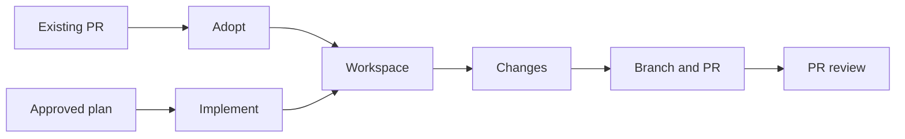

#### State machine

```mermaid
stateDiagram-v2
    [*] --> Admission
    Admission --> Skipped: issue excluded
    Admission --> PlanReview: approval missing or revoked
    Admission --> InspectPR: eligible
    InspectPR --> DirectProbe: no open PR
    DirectProbe --> Prepare: no dirty direct writer
    DirectProbe --> DirtyClaim: owned dirty direct writer
    DirtyClaim --> DirtyTurn: exact approved inputs and consumed claim
    DirtyClaim --> Failed: claim unavailable; preserve writer
    DirtyTurn --> DirtyPublish: one turn and tests succeed
    DirtyTurn --> Failed: turn or tests fail; preserve writer
    DirtyPublish --> DirtyPR: signed commit and exact lease push succeed
    DirtyPublish --> Failed: publication fails; preserve writer
    DirtyPR --> ReviewReady: strict create and exact head confirmed
    DirtyPR --> Failed: create is uncertain; preserve writer
    InspectPR --> Adopt: open PR exists
    InspectPR --> Complete: already merged
    InspectPR --> Failed: closed without merge
    Adopt --> RecoverDirty: reused workspace is dirty
    RecoverDirty --> Prepare: exact COMMIT or STASH recovery succeeds
    RecoverDirty --> Failed: identity, recovery, or postflight check fails
    Implement --> ReplyInspection: remediation fails after a writer change
    ReplyInspection --> ReplyRecovery: dirty writer
    ReplyInspection --> Failed: clean or invalid writer
    ReplyRecovery --> Implement: one valid exhaustive reply mapping
    ReplyRecovery --> Failed: invalid, incomplete, or exhausted mapping
    Adopt --> Prepare: clean workspace is safe to continue
    Adopt --> Failed: unsafe adoption
    Prepare --> Implement: workspace ready
    Prepare --> Failed: workspace unavailable
    Implement --> Publish: changes complete
    Implement --> Implement: recoverable failure
    Implement --> Failed: retry limit reached
    Publish --> ReviewReady: branch and PR durable
    Publish --> Publish: transient publication failure
    Publish --> Failed: publication failed
    ReviewReady --> [*]
    PlanReview --> [*]
    Complete --> [*]
    Skipped --> [*]
    Failed --> [*]
```

Architectural contract:

- Before it creates a direct reservation, `WORKTREE_WAIT` submits an ownership
  probe. `DIRTY_DIRECT_CLAIM_WAIT` admits only an owned dirty direct writer
  without an open PR. It retains the original branch and reservation base.
  The closed GitHub read supplies complete PR absence and current actor-owned
  plan and review evidence. Skip and blocked labels stop this route.
- The dirty direct route has one nonretryable provider turn. The host binds
  the frozen plan, review, exact allowed paths, and content snapshot to a
  version 2 claim. It consumes the claim under the source lane lock before
  provider entry. Tests can run after that turn, but failure cannot request
  another implementation or test-fix turn.
- Dirty direct publication holds the repository, Git, and source lane locks
  in that order. It checks current plan and PR evidence before staging and
  push. It publishes only an exact scoped signed DCO commit with the original
  remote SHA as its lease. `PR_CREATE` uses strict creation and cannot adopt
  a concurrent PR. Only confirmed creation with exact head readback clears
  preservation. Failures retain the receipt, reservation, and deterministic
  path for terminal reporting. See [ADR-0045](adr/0045-one-use-dirty-direct-writer-continuation.md).
- One issue maps to one active implementation pull request.
- The queue observes but never mutates auto-merge while review is pending.
- Implementation never writes `state:implementation-go`.
- Missing approval returns to plan review; unsafe or exhausted work terminates
  without approval.
- A reused dirty writer carries its registered path, branch, head, status,
  diff, index identity, tracked-content identity, and untracked-content
  identity to `DIRTY_DECISION_WAIT`. The content identities use NUL-delimited
  Git path lists and length-delimited file bytes. Only an exact final nonempty
  `COMMIT` or `STASH` line can request recovery. The host confirms the open
  unarmed writable PR and branch ownership. The Git worker then checks the
  registered identity, local and remote heads, and dirty snapshot before it
  changes the worktree. `COMMIT` creates one
  signed DCO commit with the captured head as its direct parent and publishes
  it with an exact lease. `STASH` includes untracked files and does not change
  either branch head. A clean-tree and head postflight must succeed before the
  implementation source revision is rebound. All failures preserve the writer
  worktree and any commit or stash evidence for diagnosis.
- A failed remediation event is the only trigger for reply inspection. A
  normal restored writer continues to writable remediation. After a failed
  remediation, the implementation stage asks the Git worker to inspect the
  registered repository path, branch, and expected head without a change. The
  worker rejects executable or path-redirection Git configuration before it
  reads the writer. It binds the linked-worktree metadata with no-follow
  directory descriptors when the host supplies them. On another host, it
  rejects each link, junction, and reparse point and compares file identities.
  Fixed byte, file-count, and snapshot limits bound the inspection. Empty path
  sets do not require secure content traversal. Nonempty path inspection
  requires POSIX no-follow directory-descriptor operations; another host fails
  closed instead of following a reparse point. A clean,
  invalid, or oversized inspection finishes with
  `implementation_reply_failed`. After the tests pass, the commit worker
  compares the captured head, content snapshot, candidate tree, bounded diff,
  and diff SHA-256 digest. It prepares one signed, DCO-signed child commit with
  the captured head as its only parent and the candidate tree as its exact tree.
  Preparation does not publish the commit. The stage then permits one
  receipt-only reply-recovery turn. That fresh, one-shot turn has no tools and
  receives only the canonical format-three review input and its digest. It
  cannot read the writer, edit, run Git, publish, call GitHub, or resolve
  threads. Its reply result must echo the input
  digest and contain one valid reply for each thread. Before publication, the
  worker verifies the complete format-three journal encoding. It then publishes
  only the prepared commit with the original remote-head lease. The worker uses
  private Git metadata and host signing
  configuration for this commit. Thus, a late repository configuration change
  cannot run a filter or select a publication URL. It also requires a clean
  worktree after the commit. An ambiguous or false commit result fails and
  preserves the dirty writer. It cannot prepare a reply handoff for the
  unchanged head. The stage retains the complete preparation receipt and reply
  result across a transient publication failure. A retry can publish only that
  child with the original remote-head lease. The stage does not prepare a
  second commit for this retry. It preserves the writer, snapshots, diagnostic,
  and receipt on every recovery failure.
- Before creating a direct-scope writer worktree, the coordinator atomically
  reserves its absent remote branch at the already-resolved base SHA. That
  metadata-only `git push` uses `--no-verify` so ambient pre-push hooks cannot
  turn worker ownership admission into source verification. This push contains
  no implementation changes and retains the empty `--force-with-lease`
  expectation for collision safety. One other narrow exception applies to the
  inspected dirty-writer recovery above. Its exact commit and lease-protected
  push do not run repository hooks because the repository configuration is
  untrusted input at that boundary. The bounded path manifest, content
  snapshot, exact candidate tree, signed DCO child, clean postflight, literal
  GitHub URL, and remote-head lease replace hook authority for that recovery.
  All ordinary implementation, remediation, rebase, release, and developer
  commits and pushes continue to run their configured hooks. Pre-commit hooks
  are unaffected by branch reservation because it creates no commit.
- When parallel file-overlap serialization is enabled, normal-item dependency
  order remains authoritative while repeated overlap deferrals raise priority.
  Cross-repo same-number items are interleaved with normal items by that age
  through one repo-scoped claim selector; this never lets a normal dependent
  overtake its prerequisite. The selected plan-file snapshot is retained for
  the full implementation-stage lifetime, across worktree, agent, test, and
  push jobs; serial and overlap-opt-out modes perform no claim lookup or
  tracking.

### 5.5 PR review

PR review is the sole authority for implementation approval. Reviews and
findings are recorded on the GitHub pull request so their history survives
local process or agent-session loss. The implementation stage owns each PR
branch writer, including rebase and lease-publish. At entry, and again
immediately before submitting a broad audit, PR review reads the complete
open-thread set. In the automatic queue path, threads without a current-head
implementation response go directly to writer remediation and do not create
another broad review batch. A complete set of current-head responses creates a detached,
disposable checkout for comment validation only; the reviewer resolves the
validated threads or leaves corrective feedback. An explicit operator broad
review is the only exception. It reconciles dependencies, verifies a detached
checkout of head `H`, and submits a fresh source-anchored review before it
routes all inherited and new open threads through validation, publication,
and implementation remediation. A thread-free entry also creates a detached
checkout of head `H`, verifies that checkout once, submits one batched
source-anchored review for `H`, and removes the checkout before handoff. A
later branch push does not invalidate that posted review; only the final
`state:implementation-go` transition requires the reviewed head to still be
the current open, unarmed PR head.

For the registered host-verification plan, the reviewed execution boundary
currently requires macOS `sandbox-exec` plus disposable, quota-backed disk
images. Other platforms record an exact-head, platform-bound `skipped` receipt
before they resolve tools, archive source, or execute PR code. That receipt is
a blocking host-verification gap. It is not passing execution evidence, and it
cannot grant implementation authority. Add a Linux or Windows backend as a
separately reviewed isolation implementation; there is no unsandboxed fallback.

A narrow source-review exception for PR #3006 is specified in
[ADR-0046](adr/0046-review-host-verification-bootstrap.md). An authenticated
operator comment must bind the exact head, checkout branch point, and complete
30-record operation map. The CLI comment ID only selects that grant. The
Linux skip remains failed host evidence; a separate process-local proof
permits source review. Fresh grant checks precede source-review submission,
the GO-label write, and every protected merge request. The exception cannot
review its own #3007 implementation, which requires the existing macOS path.
The current 32-record PR #3006 head is ineligible until its owner removes the
two #3035 coverage deltas and obtains a fresh exact-head grant.

Every host-verification failure also upserts an automation-owned diagnostic on
the pull request after the exact-head NOGO label is read back. The comment is
keyed by reviewed head and fixed verification ID, so an identical retry updates
instead of spamming the PR. It records the command, affected path, failure
classification, and bounded output tails; it is informational and never grants
implementation authorization.

#### Boundary diagram

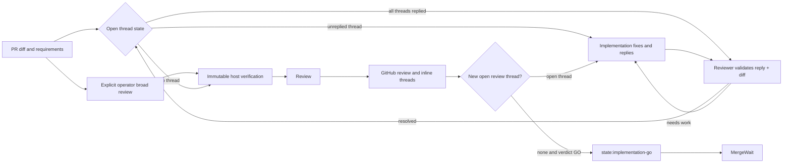

#### State machine

```mermaid
stateDiagram-v2
    [*] --> VerifyUnarmed
    VerifyUnarmed --> ThreadGate: open, complete, and unarmed
    VerifyUnarmed --> OperatorOwned: external arm or incomplete state
    ThreadGate --> Implementation: thread lacks current-head response; durable no-go
    ThreadGate --> Checkout: no open threads; broad audit
    ThreadGate --> Checkout: all threads have current-head responses; comment validation
    ThreadGate --> Checkout: explicit operator broad review; preserve inherited threads
    Checkout --> Review: broad audit entry and clean snapshot matches H
    Checkout --> Validate: comment-validation entry and clean snapshot matches H
    Checkout --> HostVerification: clean checkout matches snapshot head and fixed check is required
    HostVerification --> Review: immutable snapshot verification passed
    HostVerification --> Implementation: confirmed test failure, after durable no-go, diagnostic, and checkout cleanup
    HostVerification --> Failed: boundary/setup failure, after durable no-go diagnostic and checkout cleanup
    Checkout --> Review: clean checkout matches snapshot head, no fixed check required
    Checkout --> Failed: checkout or head drift; cleanup then a later loop gets a new snapshot
    Review --> Validate: review produced
    Review --> Implementation: invalid output requires fresh implementation context
    Validate --> Post: findings normalized
    Post --> Implementation: any open review thread, after durable no-go and checkout cleanup
    Post --> Evaluate: no open review thread
    Evaluate --> Implementation: a late open thread, after durable no-go and checkout cleanup
    Evaluate --> Approve: verdict GO and no unresolved findings; cleanup then implementation-go durable
    Approve --> MergeReady
    MergeReady --> [*]
    Implementation --> [*]
    Failed --> [*]
```

Architectural contract:

- Every implementation review is posted to the pull request.
- The initial review fetches and verifies one detached checkout of `H`, then
  submits all inline findings in one GitHub review request. It neither rebases
  nor pushes the PR branch, and its checkout is removed before it exits.
- Actionable findings use durable inline threads. Severity describes newly
  posted findings only; it never makes an existing unresolved thread advisory.
- Prior rounds remain visible in the PR timeline.
- Any open review thread without a current-head implementation response
  produces `state:implementation-no-go` and is handed to implementation
  before another broad review in the automatic queue path. An explicit operator
  broad review first uses the dependency, exact-head checkout, and complete
  thread-read gates. It then preserves all inherited and new open threads for
  the validation, publication, and implementation-remediation lifecycle. A
  fresh broad audit of a thread-free PR, or a
  fresh comment-validation pass that resolves every current thread, may produce
  `state:implementation-go` only when its typed reviewer verdict is `GO`. The
  parser treats a missing, malformed, `NOGO`, or `BLOCKED` verdict as a failed
  closed audit before any label write. The letter grade is audit metadata only.
- The implementation agent replies to every fixed open thread but never resolves it.
- After successful adopted-PR remediation, a host Git job stores the exact
  dirty candidate before the first test job. The separate version-one
  `pretest-candidate` record binds the source receipt, candidate bytes, complete
  thread snapshot, reply map, and actual successful job result. A fresh worker
  can restore an exact `ready` record and submit tests again. The record does
  not prove that tests passed and does not authorize publication.
  Before a test-fix job, the host changes the exact record to `invalidated`.
  Only a new successful job in the same process can replace that predecessor
  with the next `ready` sequence. A test-fix job retains the predecessor's
  validated replies; it does not need a new reply format. After a controlled
  signed commit, the host advances the source receipt and changes the record
  to `consumed` before publication. An incomplete transition or failed push
  preserves the local evidence. It does not start a new publication retry.
  Record updates acquire the source lane lock before the record lock. They
  compare the prior digest, archive prior bytes, and use an atomic replacement.
  Old preparation records keep their format and route. Conflicting recovery
  records stop recovery.
  An initial successful reply-only job can continue without a record when
  the same host checks prove the writer is clean and no prior record exists.
  Its process-local clean marker permits normal tests and the existing
  no-change reply path. It cannot restore dirty work or authorize publication.
  The stage clears that marker before a new mutation. A later legacy test-fix
  job does not gain durable recovery authority from the clean result.
- A remediation provider failure stores only a redacted diagnostic of at most
  500 characters. The recovery prompt fences the retained thread snapshots,
  inspection status, diff, and diagnostic. The recovery agent uses a fresh
  one-shot session in an empty host directory. It has no tools and cannot use
  the writer transcript. A missing, invalid, partial, or exhausted mapping
  fails before publication; a pushed branch cannot return to review without
  the valid mapping.
- The implementation stage rebases and lease-publishes the writer branch before
  review; a rebase is never performed by a reviewer checkout.
- When that host rebase conflicts, it remains paused under the captured base and
  PR-head lease. A separately budgeted edit-only agent may modify only the
  host-reported conflict paths and has no shell/Git tool. The host rejects a
  no-op, unresolved markers, index mutation, remote-head drift, missing captured
  base ancestry, or unsigned/non-DCO replayed commits. Only the host stages the
  resolution, continues the policy-signing rebase, and exact-lease-publishes the
  rewritten head; the result always returns to a fresh PR review.
- A post-push implementation-reply handoff is an exact, bounded host-only
  retry of one immutable response batch. A failed or partial PR-state read,
  including a per-thread read that temporarily lags the just-pushed head,
  preserves that batch for retry; a complete host read is required before it
  can instead prove the batch stale. The scratchpad copy is intentionally not
  a restart journal: before the first replay, the implementation stage writes
  the exact response map, source-snapshot fingerprint, head, and batch nonce
  to an immutable actor-owned GitHub journal record, retrying only that append
  on a transient host failure. A pushed remediation uses the remediation-only
  format-three record. This record contains the compressed canonical 16-field
  review input, its digest, the exhaustive reply result and digest, and reply
  progress. Normal handoffs keep their version-one and version-two formats.
  Remediation recovery rejects those legacy formats and incomplete
  format-three records. A restarted loop can recover only the exact record for
  the current repository, issue, PR, branch, head, and thread snapshot. An old
  record for another head is not a recovery candidate. The journal is a machine
  recovery artifact, not an implementation response, so the only human-facing
  `[Response]` remains anchored to the source review thread.
- Before its first push, the Git worker stores the exact prepared commit receipt
  and batch identity in a bounded no-follow host record. A restarted coordinator
  can use this record only if the repository, writer, branch, remote parent,
  complete thread snapshot, signed commit, tree, paths, and diff remain exact.
  Publication then uses the same prepared commit SHA.
- A pushed remediation records its exact commit as a one-use expected review
  head. The next review entry clears prior round and dependency receipts, then
  waits on the timer until GitHub reports that exact open, unarmed PR head.
  It does not create a dependency request for an older or unrelated head. If
  the expected head does not become visible within the bounded wait, the
  stage fails closed.
- The reviewer validates each implementation reply against the current diff;
  it resolves validated threads or posts corrective feedback and leaves them open.
- Validation stores an immutable fingerprint of every implementation reply
  receipt. If the current receipts differ at validation time, the stage returns
  to validation without reconciling; it never resolves based on a stale
  receipt. An unproven resolution similarly returns through fresh review and
  never attempts an unsafe compensating unresolve mutation.
- Review-thread pagination and multi-page conversation reads are stabilized by
  two matching complete rereads before they become remediation or mutation
  facts. Each reread binds the exact open PR identity before and after it,
  repeats the full pagination for all resolved and unresolved threads, and
  reads the complete comment history for every thread. A final PR identity read
  must also match. Only then does the host derive the unresolved set. A thread,
  resolution, comment, or PR-head mutation makes the read fail closed.
- Standalone PR review-thread connections follow every `hasNextPage` cursor.
  Full per-thread comment histories are limited to 2,000 comments; exceeding
  that ceiling, malformed pagination, or a cursor cycle fails the read without
  exposing partial review facts. Root-comment-only ownership and dedupe queries
  use `comments(first:1)` because later comments are outside those contracts.
- Transient implementation-reply recovery records use the PR's issue-comment
  channel, never the linked issue. Human-facing implementation responses remain
  attached to their native PR review threads.
- The review decision proof is a fresh GitHub snapshot plus a clean checkout
  at that snapshot's head. A GitHub marker can recover only a candidate reply
  after restart; it is never a substitute for that fresh proof.
- Review agents stay read-only. For an applicable Python change, the original
  broad audit receives the host's fixed, repository-owned `uv` validation
  receipts from the checkout-proven head. Comment validation instead evaluates
  the complete current-head implementation-response receipts, thread history,
  and checkout-bound diff; it does not create a second broad audit or demand
  an independent rerun of an implementation claim. Tool/dependency
  configuration changes also select the host validation plan. If the running
  `uv` environment is inside the review checkout, the host first seals a
  verifier-owned copy outside every worktree; the untracked local environment
  is never accepted as evidence. The receipts are evidence only: they are
  cleared on a new head and cannot grant `state:implementation-go` without the
  relevant fresh audit or comment-validation and GitHub checks.
- Pending and public audit recovery receipts include the typed `GO` verdict.
  Recovery rejects a receipt that does not include this verdict. Thus, a stale
  receipt cannot bypass the reviewer decision.
- No queue stage arms, disables, adopts, or polls auto-merge.

### 5.6 Merge wait

Merge wait verifies a still-valid implementation review against its
in-memory reviewed-head proof before each request. It may issue a bounded
sequence (default: five) of policy-selected server merge requests. Admission
for every request requires an open
`main` PR, an explicitly unarmed record, an exclusive implementation-GO
label, the current-process reviewed-head proof, no unresolved review threads,
and complete passing required status evidence for that head. A read-only
readiness wait may park for the `--poll-max-wait` period before a request. Its
default is 1,200 seconds (20 minutes) for each reviewed head. The wait does not
consume the merge budget or authorize a merge. After status evidence
passes, merge wait reads the stable effective policy again. The new typed policy
must equal the policy that supplied the required-check inventory. The stage
applies bypass and conversation safety to the new policy before final admission.
The adapter performs one request per call and never retries. A required merge
queue uses exact-head GraphQL admission and then lifecycle polling without a
mutation replay. If GitHub returns the typed exact already-enqueued rejection,
the adapter runs one read-only queue-entry query within the operation time that
remains. The query must prove the same open pull request node, exact reviewed
head, and valid queue entry. Only that result is successful idempotent
admission. A canceled, late, unavailable, absent, malformed, or mismatched
readback fails closed. All other uncertain mutation outcomes remain terminal.
Otherwise, direct REST merge requires strict-update protection from a source
that the current actor cannot bypass. Merge wait does not invoke `gh pr merge`,
create, disable, adopt, or poll native auto-merge, or use an administrator
bypass. An existing native auto-merge request is external ownership and is
left untouched.

#### Boundary diagram

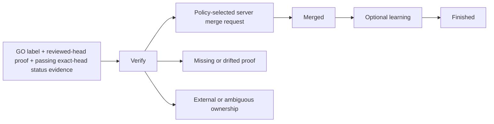

#### State machine

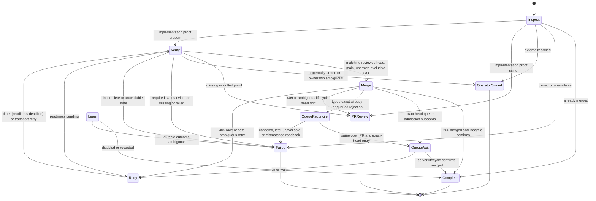

Architectural contract:

- A current-process review proof is bound to the reviewed head commit.
- Existing external merge ownership is preserved.
- Missing or drifted proof returns approval to PR review with zero label writes.
- A matching eligibility label, current-process proof, and passing exact-head
  required status evidence can submit a bounded sequence of policy-selected
  server merge requests, each only after fresh admission.
- A required merge queue uses exact-head queue admission. A typed exact
  already-enqueued rejection permits one bounded, read-only reconciliation for
  the same open pull request and reviewed head. It never permits another
  mutation. Direct merge requires strict-update protection from a source that
  the current actor cannot bypass.
- Read-only readiness polling may wait for the `--poll-max-wait` period. Its
  default is 1,200 seconds (20 minutes) for each fresh reviewed-head proof. The
  wait does not spend the request budget or authorize a merge. HTTP 409,
  transport ambiguity, and every actual request remain subject to fresh
  lifecycle, head, label, thread, and protection checks.

### 5.7 `learning`

Learning is an implicit auxiliary stage for every main-stage scope. Plan review
emits an approved-plan intent after the plan label is confirmed. Merge wait
emits a post-merge intent only after merge confirmation. The stage writes the
intent journal before dispatch, claims one deterministic key, and submits only
a host-owned `AthenaSkillJob`. The job contains a closed `learning_intent`, not
provider instructions or a fabricated delivery receipt. The host validates the
intent against the actor-owned approved plan or merged closing PR, creates one
bounded `skills/*.md` change in an isolated Mnemosyne worktree, runs the fixed
offline validator, and hands the resulting `LearnDeliveryRequest` to the
signed PR-delivery service. Known failures retry within the `learn` budget.
An ambiguous crash-left claim becomes terminal `failed` with
`outcome_unknown`; it is not submitted twice. Learning failure is ancillary
and cannot change a confirmed main result.

Dependency preparation runs frozen synchronization and package checks in a
private source export. The final sandbox command runs the prepared
environment's absolute Python interpreter with `scripts/validate_plugins.py`
from the candidate directory. It does not run `uv` or discover parent projects.
Input, artifact, and runtime checks remain mandatory before and after
validation. The sandbox denies network access to the validator and its
children and permits writes only in scratch space.

Learning fetch, publication probes, and pushes use host-owned command-scoped
Git authentication. The host resolves the trusted GitHub executable and checks
login for each remote operation. Only remote Git receives the approved GitHub
token bridges. Local Git and validators retain their existing environments.
Repository credential helpers remain prohibited; global configuration remains
disabled. Authentication and transport failures retain safe error messages.

A live claim held by another process ejects the duplicate item. The owner keeps
the claim, the main result, and the cleanup obligation. A terminal learning
record stays recoverable until `finished` records a bounded cleanup result.

Main and learning permits are separate. Handoffs reserve the bounded
destination before they release the source. Approved-plan work returns to the
scope-trimmed main destination. Post-merge work continues to `finished` only
after all intents are terminal.

### 5.8 `finished`

Finished records the final outcome exactly once and applies workspace retention
policy. A post-merge writer worktree remains available while learning runs.
Finished removes it only after all durable learning intents are terminal. The
cleanup job verifies the registered branch or detached head and refuses a
dirty checkout. It never forces removal. Finished does not change issue,
review, or merge verdicts.

States: `ENTER → RECORD → CLEANUP → DONE`.

#### Boundary diagram

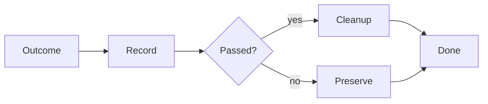

#### State machine

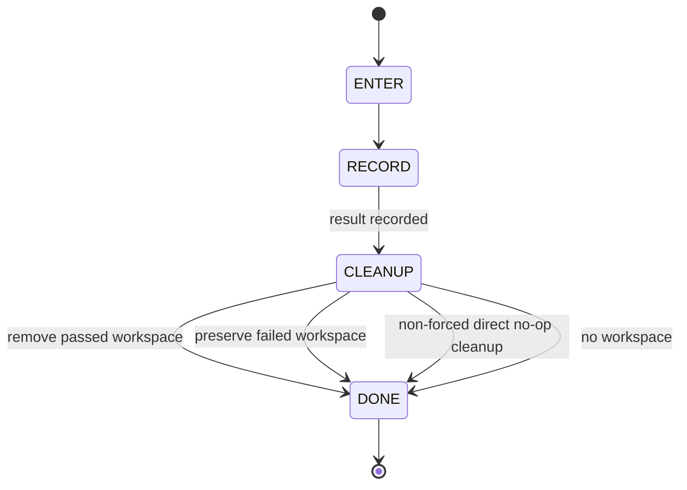

Architectural contract:

- A terminal result is recorded once.
- Failed workspaces are preserved for diagnosis, except a direct-scope no-op
  whose remote reservation was released: its known-clean worktree and local
  branch receive a non-forced cleanup so a later direct run is not blocked by
  stale deterministic state. A late dirty edit makes that cleanup fail and
  preserves the worktree instead.
- A dirty-recovery failure always preserves its writer worktree. This includes
  a failure after a commit or stash was created, so the immutable recovery
  evidence remains available.
- Successful temporary workspaces are removed when safe.
- Cleanup failure never rewrites the underlying result.

---

## 6. The ROUTES table — single source of truth

[`ROUTES`](../hephaestus/automation/pipeline/routing.py) is the sole executable
authority for pipeline order, success targets, failure targets, and per-item
budgets. Each `StageName` has one `Route`; table insertion order becomes
`PIPELINE_ORDER`, and downstream-first draining reverses that derived order.

Routing tests parameterize structural checks directly from `ROUTES` and
generate every contiguous `PipelineScope` from the derived order. They require
complete `StageName` coverage, closed success/failure targets, terminal
`FINISHED` placement and behavior, preserved main/auxiliary lane partitioning,
and positive budgets. Adding or reordering a route therefore enters validation,
scope handling, queue initialization, and drain ordering without updating
another route list.

`budget_keys()` derives the counter vocabulary from `ROUTES`, and new
`WorkItem` instances initialize those counters through `_default_attempts()`.
The `merge` default uses `DEFAULT_DRIVE_GREEN_LOOPS`; callers may override
declared budgets through `PipelineConfig.budget_overrides`. Counters remain
per-item-lifetime and are never reset when an item re-enters a stage, so
cross-stage regression cycles (e.g. pr_review → implementation) remain
globally bounded. All counters live in
[`WorkItem.attempts`](../hephaestus/automation/pipeline/work_item.py).
Operational readiness waits use a separate monotonic deadline keyed to the
current reviewed-head proof. The `--poll-max-wait` option controls the deadline,
and its default is 1,200 seconds (20 minutes).

---

## 7. Seeding and restart reconstruction

[`seeding.py`](../hephaestus/automation/pipeline/seeding.py) is the pure
classifier the coordinator consults on every restart. It maps
`(issue state, labels, PR existence/state)` to a single entry stage using **ordered
label rank**:

```
needs-plan (0) < plan-no-go (1) < plan-go (2) <
 implementation-no-go (3) < implementation-go (4)
```

The at-or-past comparison is the only read the gates trust; equality
strands issues already past target.

### Tri-state PR fetch

[`seed_issue_from_github`](../hephaestus/automation/pipeline/seeding.py)
(or its CLI counterpart
[`seed_issue`](../hephaestus/automation/pipeline/seeding.py)) runs the
two-lookup PR fetch in a strict order: open first
([`find_pr_for_issue`](../hephaestus/automation/pipeline/seeding.py)),
then merged ([`find_merged_pr_for_issue`](../hephaestus/automation/pipeline/seeding.py)).
A closed PR is invisible to both lookups and is normalized to
`pr_number = None` — the classifier then ONLY ever sees a clean
`{no live PR | open PR | merged PR}` tri-state. Fail-closed: any GitHub
error from the issue fetch OR either PR lookup propagates (so a transient
PR-probe failure cannot misclassify toward IMPLEMENTATION).

### Classification table

| GitHub state | Entry stage |
|-------------------------------------------------------|----------------------------------|
| `state:skip` | excluded (`stage = None`) |
| Closed issue with a merged PR carrying exact `Closes #N` | `FINISHED` (pass, idempotent) |
| Open/reopened issue with a historic merged PR | Treat as no open PR; route by current state label |
| Direct PR already closed | excluded |
| Valid Athena-finalized issue body | `PLANNING` no-model editor authentication, then normal downstream routing without replanning |
| Exact derived marker, explicit tracker label, title-inferred tracker, or narrow obsolete candidate | `PLANNING` independent recovery/semantic review |
| Open PR without exclusive issue-level `state:plan-go` | `PLANNING` |
| Open PR with plan-GO and PR-level `state:implementation-go` | `MERGE_WAIT` |
| Any other open PR with plan-GO | `PR_REVIEW` |
| No PR, at-or-past `state:plan-go` | `IMPLEMENTATION` |
| No PR, `state:plan-no-go` | `PLANNING` (amend path) |
| No PR, `state:plan-blocked` | excluded until an external actor resolves the block; an authenticated Athena-finalized body is the sole automatic exception |
| No state label / `state:needs-plan` | `PLANNING` |

Seeding is read-only. Explicit tracker labels are semantic candidates rather
than exclusion authority; only the independently reviewed planning disposition
may add `state:skip`.

### Seeding and re-seed scope

- `--repos` is consumed by a FIFO repository cursor; it creates repo work only
 when both the REPO queue and the global live-work window have capacity.
- `--issues` and `--prs` are direct bounded cursors. Each value is classified
 only when its eventual entry queue is guaranteed to accept it, so a large
 CLI scope is not converted into an eager seed list. `--prs` is the explicit
 route for a PR that is not reached from linked-issue discovery.
- `--org` is a resettable, paged GitHub REST repository source. It filters the
 `archived` and `fork` response fields before each name enters the FIFO source;
 repository names are not materialized up front. Linked-issue discovery uses
 100-row REST pages rather than a 500-item
 CLI limit; it does not bulk-scan every open PR
 ([`loop_repo_manager.py`](../hephaestus/automation/loop_repo_manager.py)).
When `--issues` or `--prs` is set, the resolved `--repos` list is used
ONLY for context — repo discovery is NOT enqueued, so a scoped run
cannot reconstruct every open issue in the repo (deliberate scope
isolation).
After `coordinator._seed_pass`, if all queues, active leases, source cursors,
timers, and in-flight jobs are empty,
[`_reseed_if_converged`](../hephaestus/automation/pipeline/coordinator.py)
re-seeds up to `--loops` and either exits on a zero-work pass or
continues.

### Merge-wait restart semantics

The queue is in-memory. A restart re-seeds normally through the ordinary
[`classifier`](../hephaestus/automation/pipeline/seeding.py) and does not recover
the process-local reviewed-head proof. The implementation-GO label and native
review records survive the restart only as non-authoritative context. The loop
requires a fresh automated review to recreate the process-local proof before
merge admission. A direct PR seed or restart therefore cannot use a durable
implementation-GO label by itself. Merge wait first requires a
confirmed-unarmed read, then returns the PR to review without mutating its
labels. Other-run auto-merge requests are
[blocked without adoption or mutation](../hephaestus/automation/pipeline/stages/merge_wait.py)
and require operator handling.

---

## 8. The worker pool and job contract

`WorkerPool` is the main executor. `AuxiliaryWorkerPool` is the closed
host-learning and cleanup executor. Both receive frozen specs and return bounded
[`JobResult`](../hephaestus/automation/pipeline/jobs.py) tuples. Workers never
touch `WorkItem`s or stage queues. GitHub I/O is allowed only through the
closed typed runner; generic worker code does not import the GitHub
implementation.

The neutral `commit_runtime` module owns commit staging, message validation,
signing, and commit creation. The product-facing `pr_manager.commit_changes`
compatibility adapter reads issue data before it calls this module. Pipeline
stages put immutable issue title and body values in the job. The Git worker
calls only the neutral commit seam and cannot import the GitHub client through
the commit route.

### Job kinds

Every job that can read repository source carries a provider-neutral
`WorkspaceBinding`. The binding distinguishes `source`, `session-only`, and
`external` directories. A source binding records repository-qualified
ownership, item number, lane, exact revision, generation, canonical path, and
detached state. The worker validates it immediately before provider execution
and holds the lane's cross-process lock for the whole invocation. A legacy
source-capable job whose raw `cwd` is the reusable primary checkout is rejected
before provider resolution.

The reusable default-branch checkout is only the Git synchronization and
worktree-management control plane. For each issue or linked PR, planning and
reviewer source reads reuse the detached
`build/.worktrees/auto-<#>-review` source at the captured default-branch
revision. Implementation, remediation, and writer recovery source reads reuse
`build/.worktrees/auto-<#>-impl`. Changed revisions rebind the same path and
increment its receipt generation. Review never creates a review branch. The
stable `auto-<#>-guard` ref is a CAS-protected ownership record only and never
owns a third worktree. Dirty lanes and lanes with durable learning or cleanup
obligations are preserved.
Before a direct implementation request reuses `auto-<#>-impl`, the worker
checks the receipt while it holds the implementation-lane lock. A clean
receipt for the same repository, item, path, revision, and attached branch can
be replaced only when its branch differs from the requested branch and the
worker proves the physical checkout again under the Git metadata lock. The
replacement keeps the old local branch reference. A dirty, drifted, foreign,
missing, or unproven predecessor remains unchanged and returns a typed
recovery record with the exact manual action.
The version 2 dirty direct claim is the narrow exception to dirty-lane
rejection. The host independently validates frozen `AgentJob` plan and review
inputs, issue, and repository before it consumes the exact armed receipt.
`SourceWorkspaceManager.acquire` then checks generation, physical identity,
and the shared bounded content snapshot under the lane lock. It writes and
reads back the consumed receipt before it issues an active process-local
permit. The lease covers provider execution and adapter cleanup. Serialized
claims, changed inputs, expired permits, and replay cannot authorize a turn.
Version 1 jobs keep their existing validation contract. The source manager
has no GitHub dependency. Native Codex retains workspace and approved-plan
scope checks. An explicitly selected adapter must satisfy its admission
contract and cannot fall back to native execution.
See [ADR-0045](adr/0045-one-use-dirty-direct-writer-continuation.md).

The exhaustive classification is maintained in the
[source-agent workspace inventory](source-agent-workspace-inventory.md).

- [`AgentJob`](../hephaestus/automation/pipeline/jobs.py) — Claude, Codex,
 admission-gated Pi, or OpenCode (`agent = resolve_agent(job.agent)`) with
 `prompt_builder(**prompt_kwargs)` composed in-worker.
 `resume_session_id`, when set for a direct runner, selects its persisted
 session instead of creating a fresh one; its returned id is carried in the
 `JobResult` and persisted by the coordinator under the job's logical role.
 `sandbox = "workspace-write"` (default) or `"read-only"` (including PR
 review). The agent job has no head-SHA field; the checkout barrier runs before
 it as a `verify_pr_review_checkout` Git job.
 `sandbox = "read-only"` activates `allowed_tools = "Read,Glob,Grep"`
 and `permission_mode = "dontAsk"` on the Claude call site.
- [`BuildTestJob`](../hephaestus/automation/pipeline/jobs.py) — subprocess
 argv. Security: argv MUST NOT carry untrusted strings; only the
 coordinator constructs them from vetted templates
 (`HEPHAESTUS_REQUIRED_CHECK_ARGV` for Hephaestus's automatic required-check
 gate, `PRE_PR_TEST_ARGV` for other repositories' opt-in fallback, and the
 fixed host-review verification registry). A non-null
 `verified_runner_source_revision` keeps launcher construction in the closed
 worker boundary.
- [`GitJob`](../hephaestus/automation/pipeline/jobs.py) — `op` is one operation
 in the canonical [`GIT_OPS`](../hephaestus/automation/pipeline/git_jobs.py)
 inventory. `__post_init__` validates the operation. `prepare_intake` creates
 or reuses the detached per-repository intake worktree and returns its typed
 exact-SHA receipt. Before a PR-review
 agent job, `verify_pr_review_checkout` receives the worktree path, branch,
 expected snapshot SHA, and PR number. The worker rejects a dirty checkout,
 synchronizes the branch, requires `git rev-parse HEAD` to equal that SHA, and
 checks cleanliness again ([`_git_verify_pr_review_checkout`](../hephaestus/automation/pipeline/worker_pool.py)).
 The pretest persistence job also requires a successful completion retained by
 the same worker pool. A frozen `RemediationPretestInput` supplies source,
 thread, scope, and batch pins before provider execution. Mutable prompt data
 cannot supply those pins. The pool bounds retained completions by its capacity
 and removes them on exact owner-permit release or shutdown. Fresh PR reads use
 a closed host request while the source lane lock is held; the worker rechecks
 local bytes after the read. A recovered ready sequence does not invent its
 historical predecessor digest. Live test-fix jobs must provide the exact
 invalidated predecessor before the provider can run.
- [`GitHubJob`](../hephaestus/automation/pipeline/github_jobs.py) — one frozen
 typed request. The request can recover a normal reply journal, recover a
 remediation-only format-three journal, append a prepared journal, deliver an
 exact reply handoff, reconcile one exact-head PR review, run one complete
 merge-wait cycle, create scope-expansion children, or reconcile their
 dependencies. Nested service data uses canonical JSON snapshots;
 each receipt contains its request and fresh decodes, so stage and worker never
 share mutable GitHub responses. These jobs and their wait-state names are
 process-local. Normal version-one and version-two reply records are unchanged.
 Format three is only for remediation recovery and has a separate marker and
 parser.
- [`CompactJob`](../hephaestus/automation/pipeline/jobs.py) — a best-effort
 `/compact` turn for a persisted Claude, Codex, or Pi session; it never blocks
 the retry lifecycle.
- [`AthenaSkillJob(kind="learn")`](../hephaestus/automation/pipeline/athena_skill_jobs.py)
 is the only learning job accepted by the auxiliary pool. That pool also
 accepts only `remove_worktree` and `release_branch_reservation` Git cleanup.
 It has no generic agent-dispatch path.

After a confirmed merge, the coordinator creates a compact
`PostProcessingRecord`. It retains the primary result, intent keys, resume
stage, and cleanup receipts. It removes PR diffs, review audits, prompt text,
and other stage-local payloads before the auxiliary queue accepts the item.

### Result semantics

[`JobResult.ok = False, value = None, error`](../hephaestus/automation/pipeline/jobs.py)
on any failure (return code != 0, `subprocess.TimeoutExpired`,
exception). Stdout/stderr tails are trimmed to 4 KiB in the `JobResult`;
the error message is truncated to 500 chars.

### Completion contract

Every non-cancelled `submit()` produces EXACTLY ONE
`(JobHandle, JobResult)` tuple on the completion queue
([`_on_future_done`](../hephaestus/automation/pipeline/worker_pool.py)).
Normal job failures are converted to error results in `_run`; anything
that escapes `future.result()` (exception + process-control escapes
`KeyboardInterrupt`/`SystemExit`/`GeneratorExit`) is converted to a
`worker_crash` result so a non-cancelled submit never silently loses
its completion. Only futures cancelled before starting emit no
completion (the coordinator synthesizes those).

The completion queue is bounded to `C`, and the worker callback uses
`put_nowait`. Under the global permit invariant, every in-flight job has a
reserved completion slot. If that invariant is ever violated, the callback
sets a saturation latch and wakes the coordinator; it neither blocks nor keeps
an overflow buffer. The coordinator treats that latch as a fatal internal
fault and preserves remaining in-flight items as resumable work. Signal
handlers use the same wake mechanism but only a real OS signal sets shutdown
and selects exit code 130.

### Per-repo lock layering

[`_run_git`](../hephaestus/automation/pipeline/worker_pool.py) wraps every git
operation in two locks. `_run_github` uses the same outer repository lock but
does not take the Git metadata file lock:

1. **Outer**: in-process `threading.Lock` per repo ([`_repo_lock`](../hephaestus/automation/pipeline/worker_pool.py))
 — single-thread per process serializes at most one thread per
 repo, sidestepping `flock`'s same-process ambiguity.
2. **Inner**: cross-process
 [`file_lock`](../hephaestus/utils/file_lock.py) at
 `<repo_root>/<DEFAULT_STATE_DIR>/locks/git-<repo>.lock`
 ([`_repo_lock_path`](../hephaestus/automation/pipeline/worker_pool.py))
 with a bounded wait using interruptible polling.
Both git locks are held for the entire git operation because worktrees share
`.git`. A GitHub job holds only the outer lock for its entire fresh-client
operation, enforcing the `StageGitHub` concurrency contract without implying
cross-process GitHub serialization; exact live-state guards remain authoritative
across processes.

`prepare_intake` and `sync_checkout` additionally take the status-safe
Git-metadata lock resolved by
[`WorktreeManager.git_metadata_lock_path`](../hephaestus/automation/worktree_manager.py).
For linked worktrees this resolves Git's common directory, so the primary
checkout and every linked worktree serialize synchronization and worktree
metadata mutations without leaving an untracked sentinel in the worktree.
Before inspecting the origin or worktree status, it also reads the effective
repository and worktree Git configuration with global/system configuration
disabled, rejecting executable, transport-routing, and TLS-affecting settings
from a reusable checkout.

### Resilience wiring

[`hephaestus.resilience.resilient_call`](../hephaestus/resilience/__init__.py)
wraps agent invocation. The retry predicate is
`retry_predicate=lambda _exc: not self._shutdown.is_set()` — we accept
the cost of re-running the whole agent session on a transient blip
(network reset, gh flake) because agent invocations are
workflow-idsempotent (plan/review comments upsert; implementer re-runs
converge on the same branch). Non-transient errors (`rc != 0`, timeouts)
are NOT retried.

### Rate budget + timeout mapping

- `phase_timeout_s` (CLI `--phase-timeout`) bounds each AgentJob at
 [`_submit`](../hephaestus/automation/pipeline/coordinator.py), not the
 whole phase subprocess.
- `agent_default_timeout()` / `planner_claude_timeout()` /
 `implementer_claude_timeout()` / `pr_reviewer_claude_timeout()` /
 [`...`](../hephaestus/automation/agent_config.py) remain fixed library defaults.
 The automation loop resolves its active agent, GitHub, Git, metadata, network,
 readiness, diff-collection, and pre-PR-test budgets once from typed CLI
 options. Standalone stage commands expose only the budgets used by their
 stage slice. Modern advise and learn jobs are host-owned Mnemosyne operations,
 not agent-provider subprocesses, so the queue does not expose model or agent
 timeout knobs for them. Disconnected legacy follow-up and outer plan helpers
 retain fixed, injectable function defaults. No environment fallback is
 consulted.

---

## 9. Thin CLI scope wrappers and rollout controls

Five console scripts are thin queue-pipeline scoped entry points
(preserve their historical CLI surfaces). Manual merge-driving is
out-of-band.

| Console script | Stage slice | Entry module |
|--------------------------------------|-----------------------------------|---------------------------------------------------|
| `hephaestus-plan-issues` | `planning → plan_review` | [`planner`](../hephaestus/automation/planner.py) |
| `hephaestus-implement-issues` | `implementation → pr_review` | [`implementer`](../hephaestus/automation/implementer.py) |
| `hephaestus-review-prs` | `pr_review` (internal slice) | [`pr_reviewer`](../hephaestus/automation/pr_reviewer.py) |
| `hephaestus-drive-prs-green` | `pr_review → merge_wait` | [`ci_driver`](../hephaestus/automation/ci_driver.py) |
| `hephaestus-merge-prs` | (manual merge-driving, queues disabled) | [`hephaestus.github.pr_merge`](../hephaestus/github/pr_merge.py) |
| `hephaestus-agent-stage` | (one-shot stage invocation) | [`agent_stage`](../hephaestus/automation/agent_stage.py) |

Hephaestus implementation work always runs
`bash scripts/run_ci_local.sh all --rebuild` through the
[`implementation`](../hephaestus/automation/pipeline/stages/implementation.py)
test-fix gate before commit, push, and PR creation. The fixed command executes
the repository's locally executable required source checks and cannot be
replaced by issue content or a generic test override. It rebuilds the CI image
from the candidate checkout so an older local dependency environment cannot be
reused. Because CI jobs run in parallel but the local entry point runs
serially, this profile has a two-hour hard timeout. A linked implementation
worktree's shared Git metadata is mounted read-only at its original absolute
path so hatch-vcs, tests, and scanners resolve the candidate commit without
granting container write access to repository metadata.

The implementation stage submits only the fixed command and the source
revision in a `BuildTestJob`. The closed worker resolves the system
executables and starts the host launcher. The launcher opens the runner and
its sourced shell helper with a no-follow path walk. It limits each read to 1
MiB. It compares the bytes and file modes with the immutable
implementation-source tree. The launcher then executes anonymous snapshots of
those exact bytes and closes all descriptors. A changed or unsafe candidate
runner cannot authorize native fallback.

`--run-pre-pr-tests` remains an opt-in fallback for repositories without an
automatic profile. Its vetted default is
`uv run pytest tests -q --tb=short`; programmatic callers can supply
`PipelineConfig.pre_pr_test_argv` for a different vetted fallback command.
For the Hephaestus profile, the shell reports an approved runner-initialization
failure on each platform. Approved failures are an absent engine, an
unavailable engine, and a failed container-start probe. The shell exits with
code 75 and writes one exact terminal protocol record. The stage validates the
complete protocol. On macOS, the stage changes the runner mode and runs the
fixed native command. On other platforms, the stage stops with
`pre_pr_runner_unavailable`. A native failure still blocks publication. The
test receipt uses the stage-owned runner mode and fallback reason.
GitHub-only checks that need a created PR, especially `pr-policy`, still run
after publication and remain part of the merge contract.

For hosts that cannot install GitHub CLI in the system-owned locations, the
automation loop and its direct plan, implement, and PR-review wrappers accept
the explicit, CLI-only `--gh-extra-path-root ROOT` exception. It admits only
`ROOT/bin/gh`; `ROOT` must be absolute, the executable must be executable, and
its resolved path must remain below `ROOT`. Other automation CLIs do not expose
the exception. No wrapper reads an environment equivalent or discovers this
exception through `PATH`.

The loop passes this admitted executable to its worker Git operations and its
host-owned Mnemosyne binding. Each remote Git command uses an isolated child
environment and a command-scoped `gh auth git-credential` helper. The binding
tries to fast-forward the clean checkout to the trusted default branch. A
missing helper or an update failure does not block an available local release.
The binding reads the release version from committed project metadata and
records the local commit only as provenance. It does not require that commit to
match a remote branch head. If repository resolution is unavailable, an
existing clean checkout with the exact canonical origin remains usable. An
unverified fork does not use this fallback. A missing checkout still requires
a successful clone. See
[ADR-0037](adr/0037-version-bound-mnemosyne-checkout.md).

All model options accept `MODEL[:EFFORT]`. The final nonempty colon segment is
a free-form effort value. The runtime maps it to Codex
`model_reasoning_effort`, OpenCode `--variant`, or Pi `--thinking`. The value
`default` selects the applicable provider default. Claude removes the effort
segment and uses the base model. If Codex returns the exact structured
unsupported-effort error before model output or a work item, the runtime
retries one time without an explicit effort. OpenCode and Pi apply their
native fallback behavior. See [IFM Model Configuration](ifm-models.md) and
[ADR-0036](adr/0036-free-form-model-effort-selection.md).
The parser is [`parse_model_selection()`](../hephaestus/agents/model_selection.py).
Provider argument construction and the bounded Codex retry are in
[`runtime.py`](../hephaestus/agents/runtime.py). The loop option definitions
are in [`loop_runner.py`](../hephaestus/automation/loop_runner.py).

Tool selection and model selection are independent. `--planner-agent`,
`--implementer-agent`, and `--reviewer-agent` override `--agent` for each role.
Each role model overrides `--model`, even when the role selects a different
tool. Omitted models use the selected tool's configured default. Model names
are literal strings. Hephaestus has no model catalog, alias translation, or
model-tier assignment. `--fallback-model` is explicit and does not inherit
`--model`. See [ADR-0044](adr/0044-independent-tool-model-selection.md).

When a Codex implementation adapter is selected, its private configuration
supplies omitted model and effort defaults. It does not import ambient Codex
configuration. Without an adapter, the native runner uses its configured
defaults. Supply model and effort explicitly when both paths must use the same
selection. See [ADR-0042](adr/0042-codex-implementation-process-boundary.md) and
[ADR-0043](adr/0043-optional-codex-adapter-until-production-ready.md).

The default pipeline accepts `--loops`, `--parallel-repos`, and the staged
`--issue-limit` selector, which advances 1 → 2 → 4 → 8 → all only after the
repository checkpoint verifies the previous wave. It also accepts
`--max-workers`, per-agent `--agent`, and the model options that this section
describes.

- `--learning-workers N` controls host-learning concurrency (default `1`).
- `--learning-queue-capacity N` bounds auxiliary backlog (default `1`).
- `--no-learn` creates no new learning intent.

---

## 10. Observability, dry-run and rate-budget gate

Observability is **opt-in**: it is built only when
`PipelineConfig.metrics_port > 0`. The coordinator imports
[`MetricsRegistry`](../hephaestus/observability/metrics.py),
[`MetricsHTTPServer`](../hephaestus/observability/server.py) and
[`AlertTracker`](../hephaestus/observability/alerts.py) lazily inside
the constructor so the default construction path keeps its zero-I/O
import contract
([`Coordinator.__init__`](../hephaestus/automation/pipeline/coordinator.py)).

### Bounded diagnostics and non-authoritative JSONL

The coordinator retains only finite local diagnostic state: the in-memory
event deque defaults to 1,024 records, detailed terminal items/ledger/
preserved-worktree entries default to 128, and the per-repository stage-context
cache is an LRU capped at `C`. A constant-space terminal summary still
aggregates the entire run's pass/fail totals after older details are trimmed
([`PipelineConfig.event_log_capacity`](../hephaestus/automation/pipeline/coordinator.py),
[`PipelineConfig.terminal_detail_capacity`](../hephaestus/automation/pipeline/coordinator.py),
[`Coordinator._record_terminal_result`](../hephaestus/automation/pipeline/coordinator.py)).

When `event_log_path` is configured, the coordinator also appends diagnostic
records to JSONL. That file is best-effort: an I/O failure logs a
warning and disables further JSONL writes without changing pipeline routing.
It is not a queue snapshot or recovery journal. GitHub labels, comments, and
PR state are normal restart authorities. `LearningJournalStore`,
`ArmingStateStore`, and issue-wave checkpoints supply the other durable state
listed in the journal contract above.

The loop runner owns event-log lifecycle outside the pure coordinator: it holds
the current file's activity lock and prunes only recognized inactive siblings
under configurable age/count limits. Locking or cleanup failures preserve
files, emit warnings, and do not affect pipeline routing. See
[`observability.md`](observability.md#enabling-monitoring).

### Gauges

[`_emit_observability_tick`](../hephaestus/automation/pipeline/coordinator.py)
publishes the following gauges once per coordinator tick. Each metric producer
declares its label dimensions, finite values where the domain is closed, and a
per-family series cap. Gauges retain admitted series across ticks so a
completed job or state-transition is rendered as zero, not as stale active
work; new tuples beyond a cap are dropped without evicting existing data and
are reported through `hephaestus_metrics_series_overflow_total`.

| Gauge | Type | Labels and allowed values | Cap | Default | Semantics |
|-------------------------------------------|--------|-----------|-----:|---------|-----------|
| `hephaestus_pipeline_queue_depth` | Gauge | `stage`: `repo`, `planning`, `plan_review`, `implementation`, `pr_review`, `merge_wait`, `learning`, `finished` | 8 | `0` | Item count per pipeline stage. Useful for detecting back-pressure. |
| `hephaestus_pipeline_inflight_jobs` | Gauge | (none) | 1 | `0` | Total in-flight jobs across all worker pools. |
| `hephaestus_pipeline_lane_queue_depth` | Gauge | `lane`: `main`, `auxiliary` | 2 | `0` | Queued items partitioned by worker lane. |
| `hephaestus_pipeline_lane_inflight_jobs` | Gauge | `lane`: `main`, `auxiliary` | 2 | `0` | In-flight jobs partitioned by worker lane. |
| `hephaestus_pipeline_inflight_per_repo` | Gauge | `repo`: open repository names | 100 | `0` | Main-lane in-flight jobs by repo, capped by `max_workers`. Auxiliary work is reported by the lane gauges. |
| `hephaestus_circuit_breaker_state` | Gauge | `name`: open breaker names; `state`: `closed`, `open`, `half_open` | 100 | `0` | `1` for the active state, `0` for prior states (only emitted from the optional `circuit_breaker_snapshot_provider`). |
| `hephaestus_pipeline_alert_active` | Gauge | `name`: `circuit_breaker_open`, `queue_depth_exceeds`, `pipeline_stalled` | 3 | `0` | `1` while a fired alert is unresolved, `0` when resolved. |

The `circuit_breaker_snapshot_provider` is **product-layer supplied**;
the coordinator never imports the resilience capability directly
([`PipelineConfig.circuit_breaker_snapshot_provider`](../hephaestus/automation/pipeline/coordinator.py)).
A broken provider is swallowed by a `logger.exception` and treated as
"no breakers known this tick" — observability must NEVER be able to
terminate a production automation loop.

### AlertTracker behavior

[`AlertTracker.observe(snapshot)`](../hephaestus/observability/alerts.py) is
called once per tick with the coordinator's
[`_observability_snapshot`](../hephaestus/automation/pipeline/coordinator.py).
Emitted events drive `hephaestus_pipeline_alert_active` and a best-effort
`alert_<fired|resolved>` diagnostic event-log entry.

- **Default trigger**: queue-depth threshold is read from
 [`PipelineConfig.alert_queue_depth_threshold`](../hephaestus/automation/pipeline/coordinator.py)
 (int, non-negative; the CLI tool validates this in `[tool.coverage]`-style
 pre-flight before it ever reaches the coordinator). The constructor
 fails fast on a negative input.
- **Default value**: 100. Operators tune via `--alert-queue-depth-threshold N`
 on `hephaestus-automation-loop`.
- **Resolution events**: an alert transitions to `resolved` when the depth
 drops below the threshold for a tick; `AlertTracker` is responsible
 for emitting the resolved event (the coordinator records it in the
 event log).
- **Failure-mode safety**: alerts are emitted only from measured queue
 depths and circuit-breaker snapshots, never from worker pool internal
 liveness (so a slow worker never causes an alert).

Queue depth measures ready backlog, not a queue fault: a full stage queue is
normal backpressure while a lease, timer, or source cursor retains ownership.
Completion saturation is instead an invariant-breaking fatal error and is not
represented as ordinary queue-depth pressure.

### Health endpoint

[`_health_snapshot`](../hephaestus/automation/pipeline/coordinator.py)
serves the JSON shape:

```json
{
  "queue_depths": {"repo": 0, "planning": 3},
  "inflight_per_repo": {"Hephaestus": 2},
  "inflight_jobs": 2,
  "circuit_breakers": {},
  "loops_run": 1,
  "stalled_ticks": 0,
  "status": "ok"
}
```

The accepted top-level statuses are `ok`, `degraded`, `stopping`, and `error`.
`ok` returns HTTP 200. Every other accepted status returns HTTP 503.
Missing, non-string, and unknown provider statuses are replaced with the
bounded `{"status": "error"}` HTTP 503 response.

The coordinator reports `stopping` once shutdown is requested, otherwise
`degraded` while any `evaluate_alerts()` condition is active, and otherwise
`ok`. These conditions use only the in-memory coordinator snapshot and the
configured in-memory circuit-breaker snapshot provider. Receiving an HTTP
response proves that the loopback server is live; only HTTP 200 with
`status: ok` declares the pipeline ready.

### Dry-run operator check

The canonical operator check is
`hephaestus-automation-loop --dry-run --loops 1 -v`. Stage accessors
log-and-skip mutators; when a stage requests a job the coordinator
logs `[dry-run] would <descr>` and ADVANCEs the item instead of
submitting ([`_run_item`](../hephaestus/automation/pipeline/coordinator.py)).
`--dry-run --loops 1` validates seed classification and route
reconstruction end-to-end without consuming rate budget.
Dry-run also overrides two retry semantics that would otherwise stall:

- **RETRY with `retry_delay_s`**: under dry-run a delayed retry waits on
 real-world progress (CI runs, PR merges) the preview will never make,
 so the item finishes with reason `[dry-run] would wait {delay}s`
 ([`_route_retry`](../hephaestus/automation/pipeline/coordinator.py)).
- **FAIL_BACK**: a dry-run mutator never writes the gate labels the
 earlier stage would re-check, so a regression would ping-pong until
 the safety cap; dry-run finishes with reason `[dry-run] would
 fail_back` instead ([`_route_fail_back`](../hephaestus/automation/pipeline/coordinator.py)).

---

## 11. Automation ownership and architecture budgets

The large automation entry points are compatibility façades. Their
collaborators have one-way dependencies and own explicit responsibilities:

| Facade | Collaborators | Ownership boundary |
|---|---|---|
| [`pipeline/coordinator.py`](../hephaestus/automation/pipeline/coordinator.py) | `coordinator_contract.py`, `coordinator_types.py`, `coordinator_runtime.py`, `coordinator_sources.py`, `coordinator_dispatch.py` | static host contract; configuration/types; event-loop runtime; source cursors; implementation admission |
| [`pipeline_github.py`](../hephaestus/automation/pipeline_github.py) | `pipeline_github_contract.py`, `pipeline_github_transport.py`, `pipeline_github_queries.py`, `pipeline_github_reviews.py`, `pipeline_github_mutations.py` | static host contract; adapter construction; transport; reads; review evidence; non-review mutations |
| [`pipeline/stages/pr_review.py`](../hephaestus/automation/pipeline/stages/pr_review.py) | `pr_review_threads.py`, `pr_review_verification.py`, `pr_review_diagnostics.py`, `pr_review_jobs.py`, `pr_review_gate.py` | public stage surface; thread parsing; host verification and diagnostics; jobs/worktrees; GO/NO-GO gate |

The source budgets are executable in
[`test_automation_hotspot_architecture.py`](../tests/unit/automation/test_automation_hotspot_architecture.py)
and are strictly below the pre-decomposition hotspot sizes.
Collaborators must not import their façades; the façade is the only place
that assembles them. This keeps compatibility seams patchable while making
responsibility growth visible in review.

## 12. Interrupt semantics and exit codes

The coordinator handles SIGINT, SIGTERM, SIGHUP as a two-step shutdown. The
first signal stops new admissions and drains active work into a resumable
state. A second signal, or expiry of the grace window, stops immediately.
Interrupted items record `resumable at <stage>` so durable GitHub state can
reconstruct their queue position on the next run.

Exit-code priority is:

| Priority | Code | Meaning |
|---|---:|---|
| 1 | `130` | SIGINT, SIGTERM, or SIGHUP interrupted the run; this takes priority over other outcomes. |
| 2 | `1` | At least one effective item failed, skipped, or blocked. |
| 3 | `0` | Every effective item completed successfully. |

---

## 13. Glossary

- **Coordinator** — pip line's main thread; owns all queues, the
 timer heap, in-flight registry, routing, signal handlers, GitHub
 APIs. See [`coordinator.py`](../hephaestus/automation/pipeline/coordinator.py).
- **Worker pool** — the executor for agent / build/test / git jobs.
 [`WorkerPool`](../hephaestus/automation/pipeline/worker_pool.py).
- **WorkItem** — single in-memory record moving through the pipeline.
 [`work_item.py`](../hephaestus/automation/pipeline/work_item.py).
- **StageQueue** — FIFO queue for one
 [`StageName`](../hephaestus/automation/pipeline/routing.py), owned only
 by the coordinator. [`queues.py`](../hephaestus/automation/pipeline/queues.py).
- **CompletionQueue** — the bounded main and auxiliary cross-thread payload channels
 (`queue.Queue[(JobHandle, JobResult)]`, capacity `C`). Event latches carry
 wake and saturation signals without queue payloads.
 [`queues.py`](../hephaestus/automation/pipeline/queues.py).
- **Durable journal** — GitHub labels, comments, PR state,
 `LearningJournalStore` records, `ArmingStateStore` records, and issue-wave
 checkpoints. Restart reconstruction reads these stores.
- **Timer-park** — non-blocking retry/backoff by pushing an item onto
 the coordinator timer heap
 ([`_timer_park`](../hephaestus/automation/pipeline/coordinator.py)).
- **Resumable** — interrupt outcome. `ItemResult.passed = False`,
 `reason = "resumable at <stage>"`.
- **At-or-past** — label-rank comparison that allows an item to
 short-circuit through earlier stages when it carries a later-stage
 label. Never equality.
- **Head-bound** — an artifact or check whose correctness depends on
  matching the live `headRefOid` of the PR. `pr_review` creates its
  process-local proof only after a GitHub snapshot and a clean checkout agree
  on that SHA; it rechecks the proof before writing the GO label. `merge_wait`
  compares the proof with the confirmed-unarmed live PR, reads complete passing
  required status evidence for that SHA, and issues the server route that the
  effective policy requires. It does not arm or poll native auto-merge.
- **Skip-reason marker (legacy)** — the retired `<!-- hephaestus-state-skip-reason -->` marker retained only so the compaction tool can safely identify actor-owned comments from older releases. New tracker reasons are recorded in run logs; a confirmed obsolete disposition uses its distinct bounded actor-owned explanation role under ADR-0031.
- **File-system loader** — the Jinja `FileSystemLoader` resolved from `__file__`-relative paths in [`prompts/catalog.py`](../hephaestus/prompts/catalog.py); deliberately NOT `PackageLoader` to avoid importlib editable-install staleness (#2308).
- **Advise-skipped breadcrumb** — the [`advise_skipped(reason)`](../hephaestus/automation/advise_runner.py) marker string returned by [`run_advise`](../hephaestus/automation/advise_runner.py) when Mnemosyne is unavailable, so a stage aborts as `SKIP` rather than failing; the reason is forwarded verbatim from [`resolve_marketplace`](../hephaestus/automation/advise_runner.py) (e.g. `clone_failed`, `manifest_missing`).
- **Tool scope** — the explicit `(allowed_tools, permission_mode)` pair in [`AGENT_TOOL_SCOPES`](../hephaestus/automation/pipeline/tool_scopes.py) for one of the 9 pipeline agent roles (advise, planner, plan-reviewer, implementer, pr-reviewer, comment-classifier, address-review, ci-driver, learnings); unmapped roles fall through to the read-only [`DEFAULT_TOOL_SCOPE`](../hephaestus/automation/pipeline/tool_scopes.py) per the fail-closed security contract (#2319).
- **Reasoning effort** — the free-form final segment in `MODEL[:EFFORT]`, parsed
  by [`parse_model_selection()`](../hephaestus/agents/model_selection.py). The
  runtime passes it through with
  [`_codex_model_args()`](../hephaestus/agents/runtime.py),
  [`_opencode_base_cmd()`](../hephaestus/agents/runtime.py), or
  [`_pi_automation_cmd()`](../hephaestus/agents/runtime.py). `default` selects
  the provider default. Claude uses the base model. Codex uses
  [`_run_codex_session_with_effort_fallback()`](../hephaestus/agents/runtime.py)
  to retry one exact pre-work unsupported-effort rejection without the effort.
  See [ADR-0036](adr/0036-free-form-model-effort-selection.md).
- **Review posture** — the falsification-first rubric prefix [`REVIEW POSTURE`](../hephaestus/prompts/templates/default/review_rubrics/reviewer.j2); combined with anti-inflation grading rules, the max grade is `C` for any dimension the reviewer did not actively attempt to falsify (#2302).
- **Push retry** — The ordinary writer records its local tracking head before
  publication. After a failed push, an authenticated remote probe classifies
  the result. A remote head equal to the local source proves publication
  (`remote_at_source`). An unchanged remote or failed probe permits the existing
  bounded transient retry without using the implementation budget. A first
  confirmed remote change permits one signed rebase onto that exact remote
  head, followed by an exact-lease push. The host checks the original edit
  scope before rebase and the same allowed paths against the accepted remote
  base after rebase. Later transient retries publish only the same rewritten
  commit. A conflict or second remote change stops the item before PR creation
  and preserves the failed writer. The source-lane receipt records controlled
  local commits under its ownership lock, including commits whose publication
  failed. This local ownership record does not prove remote publication.
  Receipt uncertainty stops retry. Direct-scope reservation publication retains
  its existing ownership pin and does not use this refresh path.

- **Review-thread GO gate** — every unresolved review thread, regardless of
 severity marker, prevents a `pr_review` round from advancing. Severity
 (`critical|major|minor|nitpick`) is retained as annotation on newly posted
 findings, not as a waiver for an existing thread.

- **Scope-expansion dependency gate** — `pr_review` starts with
  `SCOPE_DEPENDENCY_WAIT`. This mini-state reconciles actor-owned lifecycle
  comments before it creates a checkout or spends a review budget. An open
  child parks the source PR. A closed child without a verified merged PR needs
  operator action. A child merge must be on `main` and in the source head.
  When it is missing from the source head, `implementation` performs a
  host-only, lease-bound rebase. The rebase aborts on a conflict and verifies
  the child merge SHA as an ancestor before it pushes. When all child merges
  are in the source head, `pr_review` performs one fresh broad review. A stale
  audit cannot write the GO label.
- **Mixed scope-control gate** — before the review worker posts an inline
  thread, it records the scope-expansion lifecycle, applies the NO-GO state,
  and ensures the child issue and blocking review. The lifecycle comment keeps
  a bounded projection of each validated retraction and its reviewed diff.
  After a restart, the worker restores only these retraction threads. Ordinary
  findings and scope-expansion records stay parked until the child dependency
  is complete.

---

### Codex primary-review network policy

The Codex primary PR review selects a per-invocation permission profile that
extends the built-in read-only filesystem policy and enables network access
for normal Athena evidence collection. The host selects this profile only for
the typed PR_REVIEWER role and PR_REVIEW operation with approval never. Each
process attempt uses a new profile name with 128 random bits to avoid a
collision with a fixed ambient profile. This does not claim protection against
a same-user process that changes configuration after it observes the name. Fresh,
resumed, and effort-retry commands use the same policy. Other read-only jobs
keep their existing restrictions. Configuration rejection does not permit a
less restrictive retry.

Network capability does not authorize forge publication or imply domain
filtering. The agent returns its audit; the host retains label and protected
merge authority. Detached-source and head guards remain in force. This repair
does not add the full Git-family boundary proposed in issue #2315.
